# Agent-First Development Workflow

This document describes the complete agent-driven development workflow from ideation through implementation, testing, documentation, code review, and deployment. Each phase is handled by specialized agents.

## Overview

The agent-first approach breaks down feature development into distinct phases, each handled by specialized agents. This ensures consistency, thoroughness, and reduces the cognitive load on developers.

```mermaid
graph LR
    A[💡 Brainstorm] --> B[🗂️ Decompose]
    B --> C{Complex Feature?}
    C -->|Yes| D[🏗️ Architecture]
    C -->|Simple| F[⚡ Implementation]
    D --> E{APIs Needed?}
    E -->|Yes| G[🔌 API Design]
    E -->|No| F
    G --> F
    F --> H[🧪 Testing]
    H --> I[📚 Documentation]
    I --> J[🔍 Code Review]
    J --> K{Issues Found?}
    K -->|Yes| F
    K -->|No| L[✅ Human Review]
    L --> M[🚀 Deploy]
    
    style A fill:#e1f5ff
    style B fill:#e1f5ff
    style D fill:#fff3e1
    style G fill:#fff3e1
    style F fill:#e8f5e9
    style H fill:#e8f5e9
    style I fill:#f3e5f5
    style J fill:#f3e5f5
    style L fill:#e8f5e9
    style M fill:#e8f5e9
```



## Phase 1: Ideation 💡

### Agent: Brainstorm Agent

**When to Use**: Starting a new feature or exploring an idea

**Purpose**: Transform vague ideas into well-defined, comprehensive GitHub issues through Socratic questioning

**Input**: 
- Rough idea or problem statement
- User pain points
- Business objectives

**Process**:
1. Agent asks 10-15 targeted questions
2. User answers one at a time
3. Agent adapts follow-up questions based on answers
4. Agent synthesizes into comprehensive GitHub issue

**Output**:
- Complete GitHub issue with:
  - Problem statement
  - Proposed solution
  - User impact analysis
  - Success metrics
  - Technical considerations
  - MVP scope + future enhancements
  - Risk assessment

**Location**: `.github/agents/brainstorm.md`

**Example**: `.github/agents/brainstorm-example.md`

**Typical Duration**: 20-30 minutes

---

## Phase 2: Planning 🗂️

### Agent: Decompose Agent

**When to Use**: After brainstorming creates a comprehensive feature issue

**Purpose**: Break down complex features into actionable, independently-implementable sub-issues

**Input**: 
- GitHub issue from brainstorm phase (or manually created issue)
- Technical context about system architecture
- Team capacity considerations

**Process**:
1. Agent analyzes the feature and confirms understanding
2. Explains decomposition strategy (layer-based, component-based, etc.)
3. Generates 5-15 sub-issues with:
   - Clear, action-oriented titles
   - 3-5 specific acceptance criteria each
   - Dependencies and implementation order
   - Estimated complexity

**Output**:
- Analysis summary
- Execution plan with phases
- Detailed sub-issues ready for assignment
- Dependency map
- Parallel work opportunities identified

**Location**: `.github/agents/decompose.md`

**Example**: `.github/agents/decompose-example.md`

**Typical Duration**: 15-30 minutes

---

## Phase 3: Technical Design (Conditional) 🏗️🔌

After decomposition, you need to decide if technical design is required. Use the decision tree below.

### Decision Tree: Do You Need Design Phase?

```
┌─────────────────────────────────────────┐
│  Start: Review Sub-Issue from Decompose │
└──────────────┬──────────────────────────┘
               │
               ▼
        ┌──────────────┐
        │  Complexity  │
        │  Assessment  │
        └──────┬───────┘
               │
        ┌──────▼───────┐
        │ Is feature   │
        │ complex?     │
        │ (7+ on 1-10) │
        └──┬────────┬──┘
           │        │
         No│        │Yes
           │        │
           │        ▼
           │  ┌─────────────────┐
           │  │ New              │
           │  │ Infrastructure?  │
           │  └───┬─────────┬───┘
           │      │         │
           │    No│         │Yes
           │      │         │
           │      │         ▼
           │      │   ┌──────────────┐
           │      │   │ Architecture │──────┐
           │      │   │ Agent        │      │
           │      │   └──────────────┘      │
           │      │                         │
           │      ▼                         │
           │  ┌──────────┐                 │
           │  │ Database │                 │
           │  │ Changes? │                 │
           │  └─┬────┬───┘                 │
           │    │    │                     │
           │  No│    │Yes                  │
           │    │    │                     │
           │    │    ▼                     │
           │    │  ┌──────────────┐       │
           │    │  │ Architecture │───────┤
           │    │  │ Agent        │       │
           │    │  └──────────────┘       │
           │    │                         │
           │    ▼                         │
           │  ┌────────────┐              │
           │  │ Multiple   │              │
           │  │ APIs?      │              │
           │  └──┬─────┬───┘              │
           │     │     │                  │
           │   No│     │Yes               │
           │     │     │                  │
           │     │     ▼                  │
           │     │  ┌──────────────┐     │
           │     │  │ API Design   │─────┤
           │     │  │ Agent        │     │
           │     │  └──────────────┘     │
           │     │                       │
           │     │                       │
           ▼     ▼                       ▼
    ┌──────────────────────────────────────┐
    │       Skip to Implementation         │
    └──────────────────────────────────────┘
```

### 3A: Architecture Design 🏗️

#### Agent: Architecture Agent

**When to Use**:
- ✅ Complex features (complexity 7+ out of 10)
- ✅ New infrastructure components
- ✅ Database schema changes
- ✅ Multi-component integrations
- ✅ Performance-critical features
- ✅ Security-sensitive features

**When to Skip**:
- ❌ Simple UI changes
- ❌ Bug fixes
- ❌ Trivial refactorings
- ❌ Single-file changes

**Purpose**: Create comprehensive technical architecture including system design, data models, ADRs, and integration patterns

**Input**:
- Sub-issue from decompose phase
- Performance requirements
- Existing system constraints
- Technology preferences

**Process**:
1. Complexity assessment (determines if full design is needed)
2. Requirements clarification
3. Generate architecture design with:
   - Component diagrams (Mermaid)
   - Data models and schema
   - ADRs for key decisions
   - Integration approach
   - Security, performance, scalability considerations
4. API surface detection
5. Handoff recommendations

**Output**:
- Complete architecture design document
- ADRs for key decisions
- Mermaid diagrams
- Database migration plan
- Next steps with conditional recommendations
- **Recommendation to use API Design Agent if APIs detected**

**Location**: `.github/agents/architecture.md`

**Example**: `.github/agents/architecture-example.md`

**Typical Duration**: 30-60 minutes

---

### 3B: API Design 🔌

#### Agent: API Design Agent

**When to Use**:
- ✅ Recommended by Architecture Agent (APIs detected)
- ✅ Creating new REST/GraphQL/WebSocket/gRPC APIs
- ✅ Modifying existing API contracts
- ✅ Adding endpoints to existing APIs
- ✅ Complex API interactions

**When to Skip**:
- ❌ No APIs in the feature
- ❌ Internal function interfaces (not external APIs)
- ❌ Simple CRUD with well-established patterns (optional)

**Can Work**:
- **With Architecture Context** (Recommended): Receives architecture decisions and aligns API design
- **Standalone**: For simple API changes without architecture phase

**Purpose**: Create detailed API specifications including OpenAPI/AsyncAPI specs, authentication, error handling, and security

**Input**:
- Architecture document (if available)
- Sub-issue or feature description
- Existing API patterns in codebase
- Authentication requirements

**Process**:
1. Check for architecture context
2. Analyze requirements for API needs
3. Design comprehensive API specifications:
   - Endpoint definitions
   - Request/response schemas
   - Authentication/authorization
   - Error responses
   - Rate limiting
   - Security patterns
4. Generate OpenAPI/AsyncAPI specification
5. Provide implementation guidance

**Output**:
- Complete API design document
- OpenAPI 3.0 or AsyncAPI 2.0 specification
- Request/response examples
- Security considerations
- Implementation notes referencing existing code patterns

**Location**: `.github/agents/api-design.md`

**Example**: `.github/agents/api-design-example.md`

**Typical Duration**: 30-45 minutes

---

## Phase 4: Implementation ⚡

**When to Use**: After planning (and design if needed) is complete

**Who Does It**: 
- Coding agents (GitHub Copilot, custom implementation agents)
- Human developers

**Input**:
- Sub-issues from decompose agent
- Architecture document (if created)
- API specification (if created)
- Acceptance criteria

**Process**:
1. Read attached design documents
2. Follow architecture patterns
3. Implement per API specifications
4. Write tests per acceptance criteria
5. Create PR for review

**Tools**:
- GitHub Copilot for code generation
- Custom coding agents
- Traditional development

**Typical Duration**: Varies by sub-issue (1-5 days per sub-issue)

---

## Phase 5: Quality Assurance 🎯

After implementation and testing, the quality assurance phase ensures code is well-documented and meets quality standards before human review.

### 5A: Documentation 📚

#### Agent: Documentation Agent

**When to Use**:
- ✅ After implementing new features
- ✅ Creating or updating APIs
- ✅ Adding new components or libraries
- ✅ When documentation gaps identified

**When to Skip**:
- ❌ Trivial changes (typo fixes, minor style changes)
- ❌ Internal refactoring with no API changes
- ⚠️ Bug fixes (document if behavior changes)

**Purpose**: Generate and maintain comprehensive technical documentation including API references, code comments, user guides, and changelogs

**Input**:
- Implementation code from Phase 4
- PR or code changes to document
- Architecture document (if created)
- API specification (if created)
- Existing documentation to update

**Process**:
1. Documentation scope assessment
2. Context gathering (audience, format preferences)
3. Generate documentation:
   - API reference with examples
   - Code documentation (JSDoc/docstrings)
   - User guides and tutorials
   - Changelog entries
   - README updates
4. Gap identification
5. Documentation review and integration

**Output**:
- Complete documentation suite with:
  - API reference documentation
  - Inline code documentation
  - User guides
  - Changelog entries
  - README updates
  - Multiple language examples
  - Gap analysis report

**Location**: `.github/agents/documentation.md`

**Example**: `.github/agents/documentation-example.md`

**Typical Duration**: 10-15 minutes

---

### 5B: Code Review 🔍

#### Agent: Code Review Agent

**When to Use**:
- ✅ Before requesting human code review (always)
- ✅ After implementation and testing
- ✅ As automated quality gate in CI/CD
- ✅ Before merging to main branch

**When to Skip**:
- Never! Even simple changes benefit from automated review

**Purpose**: Automated first-pass code review with comprehensive, actionable feedback across security, quality, performance, testing, and documentation

**Input**:
- PR URL or code changes to review
- Acceptance criteria from decomposition
- Architecture document (if available)
- API specification (if available)
- Documentation from Phase 5A

**Process**:
1. Review scope analysis
2. Comprehensive review across categories:
   - Security (SQL injection, XSS, auth issues)
   - Code quality (duplication, complexity, best practices)
   - Performance (N+1 queries, algorithms, caching)
   - Test coverage (>80% threshold, edge cases)
   - Documentation completeness
   - Accessibility (WCAG for UI)
3. Prioritize findings by severity
4. Generate actionable feedback with code examples
5. Developer addresses issues
6. Re-review if significant changes

**Output**:
- Comprehensive code review with:
  - Executive summary with key findings
  - Critical issues (🔴 Must fix)
  - High priority issues (🟠 Should fix)
  - Medium priority issues (🟡 Consider fixing)
  - Low priority suggestions (🟢 Nice to have)
  - Positive observations
  - Specific line numbers and fix examples
  - Severity levels and estimated fix times
  - Security summary (OWASP coverage)
  - Performance impact analysis
  - Test coverage analysis
  - Acceptance criteria validation

**Location**: `.github/agents/code-review.md`

**Example**: `.github/agents/code-review-example.md`

**Typical Duration**: 5-10 minutes (automated)

---

## Phase 6: Human Review ✅

**When to Use**: After automated code review and addressing critical/high priority issues

**Who Does It**:
- Senior developers
- Tech leads
- Domain experts

**Process**:
1. Review automated code review findings
2. Verify critical issues addressed
3. Focus on architecture and business logic
4. Check design adherence
5. Validate acceptance criteria
6. Approve or request changes

**Typical Duration**: 1-2 hours (30-50% faster with automated review)

---

## Phase 7: Deploy 🚀

**When to Use**: After implementation is complete

**Who Does It**:
- Code review agents
- Human reviewers
- Automated testing

**Process**:
1. Verify acceptance criteria met
2. Check adherence to architecture
3. Validate API contracts
4. Security review
5. Performance testing

**Typical Duration**: 1-2 days

---

## Phase 6: Deploy 🚀

**When to Use**: After review is approved

**Process**:
1. Merge to main branch
2. CI/CD pipeline runs
3. Deploy to staging
4. Validation tests
5. Deploy to production
6. Monitor metrics

**Typical Duration**: 1-2 hours to days (depending on deployment strategy)

---

## Complete Workflow Examples

### Example 1: Complex Feature - Real-Time Notification System

**Scenario**: Adding WebSocket-based real-time notifications for error documentation

```
1. Brainstorm Agent (20 min)
   ↓ Creates comprehensive issue
   
2. Decompose Agent (25 min)
   ↓ Breaks into 9 sub-issues across 5 phases
   
3. Review Sub-Issue #2: "Build Real-Time Notification System"
   ↓ Complexity Assessment: 8/10 (High)
   
4. Architecture Agent (45 min)
   ↓ Designs WebSocket architecture with Redis pub/sub
   ↓ Detects WebSocket API needed
   ↓ Recommends: "Invoke API Design Agent"
   
5. API Design Agent (40 min)
   ↓ Designs WebSocket protocol with 10 message types
   ↓ Creates AsyncAPI specification
   ↓ Provides Socket.io implementation examples
   
6. Implementation (2-3 weeks)
   ↓ Backend team builds WebSocket server
   ↓ Frontend team integrates Socket.io client
   ↓ Following architecture and API specs
   ↓ Write comprehensive tests
   
7. Documentation Agent (15 min)
   ↓ Generates WebSocket API documentation
   ↓ Creates JSDoc for all message handlers
   ↓ Writes user guide for real-time features
   ↓ Updates changelog with new capabilities
   
8. Code Review Agent (10 min)
   ↓ Finds 2 critical security issues (auth, rate limiting)
   ↓ Identifies N+1 query in notification loading
   ↓ Suggests caching for user preferences
   ↓ Validates test coverage (85% - good!)
   ↓ Confirms documentation completeness
   
9. Developer Fixes Issues (1 day)
   ↓ Addresses security vulnerabilities
   ↓ Optimizes database queries
   ↓ Adds caching layer
   
10. Re-Review (5 min)
    ↓ Code Review Agent verifies fixes
    ↓ All critical issues resolved ✅
   
11. Human Review (2 days)
    ↓ Tech lead reviews architecture adherence
    ↓ Domain expert validates business logic
    ↓ Approves PR
    
12. Deploy (1 week gradual rollout)
    ↓ 10% → 50% → 100% of users
    
Total: 4-5 weeks from idea to production
Quality: High - caught security issues before human review
```

---

### Example 2: Medium Feature - REST API for User Preferences

**Scenario**: Adding CRUD API for user preference management

```
1. Brainstorm Agent (15 min)
   ↓ Creates issue for user preferences feature
   
2. Decompose Agent (15 min)
   ↓ Breaks into 5 sub-issues
   
3. Review Sub-Issue: "Create User Preferences API"
   ↓ Complexity Assessment: 4/10 (Medium)
   ↓ Decision: Skip Architecture, use API Design only
   
4. API Design Agent (25 min) - STANDALONE MODE
   ↓ Designs RESTful CRUD endpoints
   ↓ Creates OpenAPI 3.0 specification
   ↓ No architecture context, uses existing patterns
   
5. Implementation (1 week)
   ↓ Backend implements endpoints per spec
   ↓ Frontend integrates with API
   ↓ Write unit and integration tests
   
6. Documentation Agent (12 min)
   ↓ Generates API reference with curl examples
   ↓ Creates JSDoc for all endpoints
   ↓ Writes user guide for preferences feature
   ↓ Updates changelog
   
7. Code Review Agent (8 min)
   ↓ Finds 1 medium issue (missing input validation)
   ↓ Suggests optimization (caching user preferences)
   ↓ Notes good test coverage (88%)
   ↓ Documentation complete ✅
   
8. Developer Fixes (2 hours)
   ↓ Adds input validation
   ↓ Implements caching
   
9. Human Review (1 day)
   ↓ Quick approval - automated review caught issues
   
10. Deploy (2 days)
    ↓ Staging → Production
    
Total: 2 weeks from idea to production
Quality: Good - simple issues caught early
```

---

### Example 3: Simple Feature - UI Component

**Scenario**: Adding a new button to existing page

```
1. Brainstorm Agent (10 min) - OPTIONAL
   ↓ Or just write GitHub issue manually
   
2. Decompose Agent (10 min) - OPTIONAL
   ↓ Or break down manually
   
3. Complexity Assessment: 1/10 (Trivial)
   ↓ Decision: Skip Architecture AND API Design
   
4. Implementation (2 hours)
   ↓ Add button component
   ↓ Wire up event handler
   ↓ Update tests
   
5. Documentation Agent (5 min) - OPTIONAL
   ↓ Update component documentation if needed
   ↓ Or skip for trivial changes
   
6. Code Review Agent (5 min)
   ↓ Verifies accessibility (ARIA labels ✅)
   ↓ Checks event handler (looks good)
   ↓ Tests updated ✅
   ↓ All clear!
   
7. Human Review (30 min)
   ↓ Quick visual check
   ↓ Approves
   
8. Deploy (same day)
   
Total: 1 day from idea to production
Quality: Fast with automated checks
```

---

### Example 4: Database Schema Change

**Scenario**: Adding new tables for audit logging

```
1. Decompose Agent (optional, or direct from issue)
   ↓ Sub-issue: "Add Audit Log Tables"
   
2. Complexity Assessment: 6/10 (Medium-High)
   ↓ Database changes detected
   ↓ Decision: Use Architecture Agent, skip API Design
   
3. Architecture Agent (30 min)
   ↓ Designs schema with proper indexes
   ↓ Creates migration plan
   ↓ Documents rollback strategy
   ↓ No APIs detected → Skip API Design
   
4. Implementation (3 days)
   ↓ Write migrations
   ↓ Test in staging
   ↓ Update application code
   ↓ Write tests
   
5. Documentation Agent (10 min)
   ↓ Documents new schema
   ↓ Creates migration guide
   ↓ Updates data dictionary
   ↓ Changelog entry
   
6. Code Review Agent (8 min)
   ↓ Reviews migration safety
   ↓ Verifies rollback plan
   ↓ Checks index performance
   ↓ All looks good ✅
   
7. Human Review (2 days)
   ↓ DBA review
   ↓ Test rollback in staging
   ↓ Approves
   
8. Deploy (1 day)
   ↓ Run migration in production
   
Total: 1-2 weeks
Quality: High - caught potential migration issues
```

---

## Decision Matrix: Which Agents When?

| Feature Type | Brainstorm | Decompose | Architecture | API Design | Documentation | Code Review | Total Time |
|--------------|------------|-----------|--------------|------------|---------------|-------------|------------|
| **New major feature** | ✅ Yes | ✅ Yes | ✅ Yes | ⚠️ If APIs | ✅ Yes | ✅ Yes | 1.5-2.5 hours design + QA |
| **REST API (complex)** | ⚠️ Optional | ⚠️ Optional | ✅ Yes | ✅ Yes | ✅ Yes | ✅ Yes | 1-2 hours design + QA |
| **REST API (simple CRUD)** | ❌ No | ❌ No | ❌ No | ✅ Yes | ✅ Yes | ✅ Yes | 30-45 min design + QA |
| **WebSocket/Real-time** | ✅ Yes | ✅ Yes | ✅ Yes | ✅ Yes | ✅ Yes | ✅ Yes | 2-2.5 hours design + QA |
| **Database schema change** | ⚠️ Optional | ⚠️ Optional | ✅ Yes | ❌ No | ✅ Yes | ✅ Yes | 30-90 min design + QA |
| **UI-only feature** | ⚠️ Optional | ⚠️ Optional | ❌ No | ❌ No | ⚠️ Optional | ✅ Yes | 0-20 min design + 10 min QA |
| **Bug fix** | ❌ No | ❌ No | ❌ No | ❌ No | ⚠️ If changes | ✅ Yes | 5-15 min QA only |
| **Refactoring** | ❌ No | ⚠️ Optional | ⚠️ If complex | ❌ No | ⚠️ If APIs change | ✅ Yes | 0-30 min design + 10 min QA |
| **Third-party integration** | ⚠️ Optional | ✅ Yes | ✅ Yes | ⚠️ Sometimes | ✅ Yes | ✅ Yes | 1-2 hours design + QA |
| **Background job** | ⚠️ Optional | ⚠️ Optional | ⚠️ If complex | ❌ No | ✅ Yes | ✅ Yes | 0-60 min design + QA |

**Legend**:
- ✅ Yes: Strongly recommended
- ⚠️ Optional: Use judgment, consider complexity
- ❌ No: Skip this phase

---

## Agent Collaboration Model

### Sequential Workflow (Most Common)

```
Brainstorm → Decompose → Architecture → API Design → Implementation
```

**Best For**: 
- New features
- Complex systems
- When requirements need exploration

**Handoffs**:
1. Brainstorm → Decompose: Issue URL passed
2. Decompose → Architecture: Sub-issue URL passed
3. Architecture → API Design: Architecture doc link passed
4. API Design → Implementation: API spec link attached to sub-issues

---

### Standalone API Design

```
Issue → API Design → Implementation
```

**Best For**:
- Simple API additions
- Modifying existing endpoints
- When architecture is already established

**Example**: Adding pagination to existing endpoint

---

### Skip Design Phases

```
Issue → Implementation
```

**Best For**:
- UI-only changes
- Bug fixes
- Simple refactorings
- When patterns are well-established

**Risk**: Higher chance of inconsistency, rework

---

## Best Practices

### When to Use Brainstorm Agent

**✅ Use When**:
- Feature idea is vague or exploratory
- Need to involve multiple stakeholders
- Want structured thinking about trade-offs
- Building case for new feature

**❌ Skip When**:
- Requirements are crystal clear
- Just fixing a bug
- Time-sensitive small changes

---

### When to Use Decompose Agent

**✅ Use When**:
- Feature has multiple components
- Need to parallelize work across team
- Want clear acceptance criteria
- Planning sprints

**❌ Skip When**:
- Single atomic task
- Already have clear task breakdown
- Extremely urgent hotfix

---

### When to Use Architecture Agent

**✅ Use When**:
- Complexity score 7+ out of 10
- New infrastructure components
- Database schema changes
- Performance/security critical
- Multi-system integration

**❌ Skip When**:
- Complexity score below 4
- Well-established patterns apply
- UI-only changes
- Simple bug fixes

**⚠️ Optional When**:
- Complexity score 4-6
- Small database changes
- Refactoring existing code

---

### When to Use API Design Agent

**✅ Use When**:
- Creating new APIs (REST, GraphQL, WebSocket, gRPC)
- Modifying API contracts
- Multiple endpoints
- External-facing APIs
- Need OpenAPI specification

**❌ Skip When**:
- No APIs in feature
- Internal function interfaces only
- Following well-established CRUD pattern

**⚠️ Optional When**:
- Single simple CRUD endpoint
- Internal APIs with established patterns

---

## Agent Invocation Commands

### Brainstorm Agent
```
I want to brainstorm a new feature
```
or
```
Use .github/agents/brainstorm.md to help me explore this idea
```

### Decompose Agent
```
Decompose this GitHub issue into sub-issues: [issue URL]
```
or
```
Use .github/agents/decompose.md to break down this feature
```

### Architecture Agent
```
Design the architecture for issue #105
```
or
```
@architecture analyze sub-issue #2 and create technical design
```

### API Design Agent
```
@api-design design APIs for issue #105 using this architecture: [architecture link]
```
or
```
Design REST API for user preferences feature
```

---

## Measuring Success

### Metrics to Track

**Design Phase Efficiency**:
- Time from issue creation to implementation-ready
- Rework rate (how often do we need to redesign?)
- Blocker rate (waiting for design decisions)

**Implementation Quality**:
- Bug rate in features with vs. without design phase
- Security issues found in review
- Performance issues requiring rework

**Developer Experience**:
- Developer confidence level when starting implementation
- Questions about technical approach during implementation
- PR revision count

**Business Impact**:
- Time to market for features
- Feature quality (user satisfaction)
- Maintenance burden (post-launch bug rate)

### Expected Improvements

With proper use of design agents:
- **30-50% reduction** in implementation rework
- **20-30% improvement** in time to market (despite upfront design)
- **40-60% reduction** in architecture questions during implementation
- **Higher developer satisfaction** with clear specifications

---

## Troubleshooting

### "Architecture Agent says my feature is too simple"
- Trust the complexity assessment
- Proceed to implementation with existing patterns
- Saves time on unnecessary design

### "API Design Agent asks for architecture context but I skipped that phase"
- For simple APIs, choose "Continue anyway" in standalone mode
- For complex APIs, go back and run Architecture Agent first
- Use judgment: if you're unsure, do architecture first

### "I have architecture but agent recommends API Design, can I skip?"
- You can, but not recommended if:
  - Multiple endpoints
  - Complex protocols (WebSocket, gRPC)
  - External-facing APIs
  - Team needs OpenAPI spec
- Safe to skip if:
  - Internal APIs
  - Established CRUD patterns
  - Time-critical

### "Design phase taking too long"
- Ensure you provide complete context upfront
- Answer agent questions thoroughly the first time
- For urgent work, skip to implementation with known risks

---

## Summary

The agent-first workflow provides a systematic approach to feature development:

1. **💡 Brainstorm** - Explore ideas thoroughly
2. **🗂️ Decompose** - Break into actionable work
3. **🏗️ Architecture** (conditional) - Design system architecture
4. **🔌 API Design** (conditional) - Specify API contracts
5. **⚡ Implementation** - Build with clear specifications
6. **🧪 Testing** - Validate functionality
7. **📚 Documentation** - Generate comprehensive docs
8. **🔍 Code Review** - Automated quality check
9. **✅ Human Review** - Final validation
10. **🚀 Deploy** - Ship with confidence

**Key Principle**: Use the right amount of design for the complexity of the feature. Not every feature needs full architecture, but complex features benefit immensely from upfront design. QA agents (Documentation + Code Review) should be used on nearly all changes.

**Remember**: 
- Design time is typically 1-10% of total feature time
- QA time is typically 15-30 minutes (automated)
- But prevents 30-50% of implementation rework
- Catches 80%+ of common issues before human review
- ROI is highly positive for medium-complex features

**Quality Impact**:
- **30-50% reduction** in code review time
- **80%+ of issues** caught before human review
- **Consistent documentation** quality
- **Complete audit trail** from ideation to deployment

**When in doubt**: 
- Err on the side of more design for complex features, less for simple ones
- **Always** use Documentation Agent for user-facing changes
- **Always** use Code Review Agent before human review
- The complexity assessment in the Architecture Agent helps make design decisions
