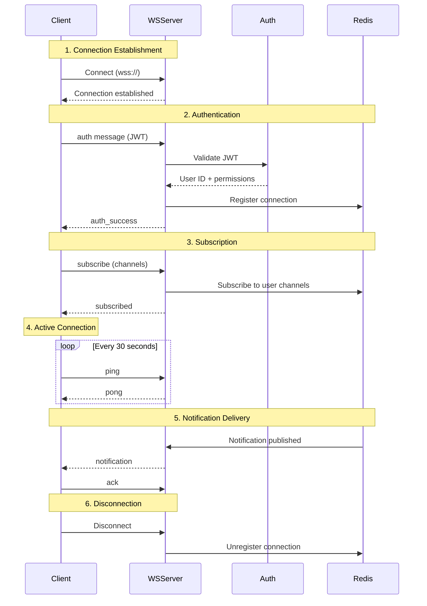
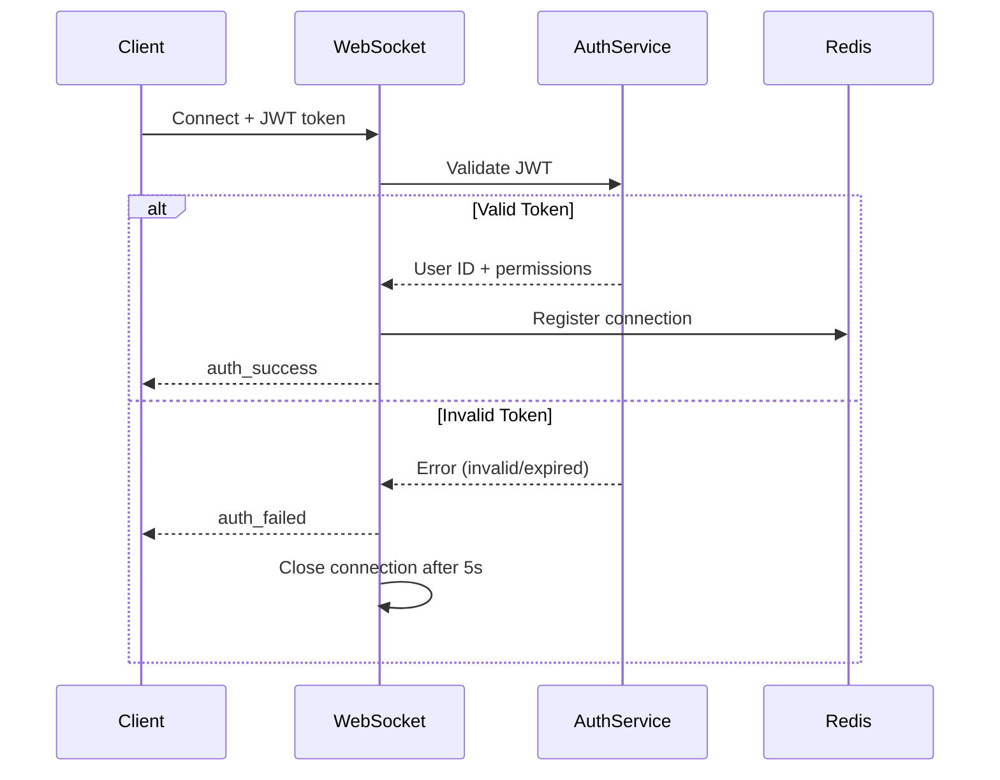

# API Design Agent - Example Session

This document demonstrates a complete API design workflow, showing how the agent takes architecture context and creates detailed API specifications for a WebSocket-based notification system.

## Input: Architecture Document Context

The following architecture was created by the Architecture Agent for the Real-Time Notification System:

**Key Architectural Context**:
- **Feature**: Real-Time Notification System for error documentation suggestions
- **Technology Stack**: Node.js, Socket.io v4, Redis Pub/Sub, PostgreSQL
- **Authentication**: JWT Bearer tokens (existing system)
- **Performance Target**: <100ms notification delivery
- **Scale**: 2,000 concurrent connections (MVP), 10,000 future
- **API Type**: WebSocket with Socket.io
- **Integration**: Error handler publishes to Redis, WebSocket servers subscribe and deliver to clients

**Architecture Decisions**:
- ADR-001: Redis pub/sub for cross-server routing
- ADR-002: Dual state storage (Redis + PostgreSQL)
- ADR-003: Sticky sessions at load balancer

## Example API Design Session

**Agent**: Hello! I'm the API Design Agent. I'll help you create comprehensive API specifications for your feature.

I see you have a sub-issue for building a Real-Time Notification System. Let me check if there's architecture context available.

---

### Context Check

🔍 **Checking for architectural context...**

✅ **Architecture document found** for Real-Time Notification System

📋 **Key Architectural Context Extracted**:
- **Authentication**: JWT Bearer tokens
- **Data Models**: WebSocketConnection, Notification entities
- **Technology Stack**: Node.js with Socket.io v4
- **Integration Points**: Error handler, JWT auth service, Redis pub/sub
- **Performance Requirements**: <100ms delivery latency, 2,000+ concurrent connections
- **Security**: Channel-level authorization, rate limiting (100 msg/min per user)

Using this context to design WebSocket APIs that align with the architecture...

---

**Agent**: Perfect! I have the architectural context. Now let me gather specific requirements for the API design.

**Questions**:

1. **Message Types**: Besides error documentation notifications, are there other notification types that need to be supported?

2. **Client Platforms**: You mentioned web and mobile. Any specific platforms (iOS, Android, React Native)?

3. **Existing API Patterns**: Do you have existing WebSocket or real-time APIs I should follow for consistency?

**User**: 
1. For MVP, just error documentation notifications. Future: system alerts, mentions, updates.
2. Web (React), iOS (Swift), Android (Kotlin).
3. No existing WebSocket APIs. This is our first real-time feature. Use industry best practices.

---

**Agent**: Excellent! I have everything I need. I'll design a comprehensive WebSocket API specification using Socket.io protocol, following best practices for authentication, error handling, and message formats.

---

## API Design Document

### Executive Summary

**Feature**: Real-Time Notification System WebSocket API
**API Type**: WebSocket (Socket.io v4 protocol)
**Number of Message Types**: 10 (5 client→server, 5 server→client)
**Authentication**: JWT Bearer token (in handshake or first message)
**Versioning**: Message-level versioning (v1 namespace)

This WebSocket API enables real-time delivery of error documentation suggestions to users across web and mobile platforms. The protocol supports authentication, subscription management, bidirectional communication, and graceful error handling with automatic reconnection.

---

### API Overview

#### Message Types Summary

**Client → Server Messages**

| Message Type | Purpose | Auth Required | Rate Limit |
|--------------|---------|---------------|------------|
| `auth` | Authenticate connection with JWT | No | N/A |
| `subscribe` | Subscribe to notification channels | Yes | 10/min |
| `unsubscribe` | Unsubscribe from channels | Yes | 10/min |
| `ack` | Acknowledge notification received | Yes | 100/min |
| `ping` | Keep-alive heartbeat | Yes | Unlimited |

**Server → Client Messages**

| Message Type | Purpose | Trigger |
|--------------|---------|---------|
| `auth_success` | Authentication succeeded | After valid `auth` message |
| `auth_failed` | Authentication failed | After invalid `auth` message |
| `subscribed` | Subscription confirmed | After `subscribe` message |
| `notification` | New notification delivery | Error occurs + docs matched |
| `pong` | Keep-alive response | After `ping` message |
| `error` | Error occurred | Invalid message, rate limit, etc. |

---

### WebSocket Connection

#### Endpoint

**Production**: `wss://api.example.com/v1/notifications`
**Staging**: `wss://api-staging.example.com/v1/notifications`
**Local Dev**: `ws://localhost:3001/v1/notifications`

#### Connection Establishment

**Option 1: JWT in Query Parameter (Recommended for simplicity)**
```
wss://api.example.com/v1/notifications?token=<JWT_TOKEN>
```

**Option 2: JWT in First Message (Recommended for security)**
```
// Connect without token
wss://api.example.com/v1/notifications

// Send auth message immediately after connection
{
  "type": "auth",
  "id": "msg-001",
  "payload": {
    "token": "eyJhbGciOiJIUzI1NiIsInR5cCI6IkpXVCJ9..."
  }
}
```

#### Connection Lifecycle



#### Socket.io Client Setup

**Web (JavaScript/React)**
```javascript
import { io } from 'socket.io-client';

const socket = io('wss://api.example.com/v1/notifications', {
  auth: {
    token: getUserToken() // JWT token
  },
  transports: ['websocket', 'polling'], // Try WebSocket first, fallback to polling
  reconnection: true,
  reconnectionDelay: 1000,
  reconnectionDelayMax: 5000,
  reconnectionAttempts: Infinity,
  timeout: 10000
});

socket.on('connect', () => {
  console.log('Connected:', socket.id);
});

socket.on('disconnect', (reason) => {
  console.log('Disconnected:', reason);
});
```

**iOS (Swift with Socket.IO-Client-Swift)**
```swift
import SocketIO

let manager = SocketManager(
    socketURL: URL(string: "wss://api.example.com/v1/notifications")!,
    config: [
        .log(true),
        .compress,
        .extraHeaders(["Authorization": "Bearer \(token)"]),
        .reconnects(true),
        .reconnectAttempts(-1), // Infinite
        .reconnectWait(1)
    ]
)

let socket = manager.defaultSocket

socket.on(clientEvent: .connect) { data, ack in
    print("Connected")
}

socket.on(clientEvent: .disconnect) { data, ack in
    print("Disconnected")
}

socket.connect()
```

**Android (Kotlin with Socket.IO-client-java)**
```kotlin
import io.socket.client.IO
import io.socket.client.Socket

val options = IO.Options().apply {
    reconnection = true
    reconnectionDelay = 1000
    extraHeaders = mapOf("Authorization" to listOf("Bearer $token"))
}

val socket = IO.socket("wss://api.example.com/v1/notifications", options)

socket.on(Socket.EVENT_CONNECT) {
    println("Connected")
}

socket.on(Socket.EVENT_DISCONNECT) {
    println("Disconnected")
}

socket.connect()
```

---

### Message Format Standard

All messages follow this JSON structure:

```typescript
interface BaseMessage {
  type: string;           // Message type identifier
  id: string;             // Unique message ID (UUID v4)
  timestamp?: string;     // ISO 8601 timestamp (server adds for server→client)
  payload?: object;       // Message-specific data
}
```

**Message ID Format**: `msg-{UUID}` or `notif-{UUID}`
**Timestamp Format**: ISO 8601 with UTC timezone (e.g., `2026-01-20T13:00:00Z`)

---

### Client → Server Messages

#### 1. Authentication Message

**Type**: `auth`

**Purpose**: Authenticate the WebSocket connection with a JWT token

**When to Send**: Immediately after connection establishment (if not sent in query parameter)

**Format**:
```json
{
  "type": "auth",
  "id": "msg-001",
  "payload": {
    "token": "eyJhbGciOiJIUzI1NiIsInR5cCI6IkpXVCJ9.eyJzdWIiOiJ1c2VyLTEyMyIsImlhdCI6MTY0MjY4NDgwMCwiZXhwIjoxNjQyNjg4NDAwfQ.abc123"
  }
}
```

**Payload Schema**:
```typescript
interface AuthPayload {
  token: string;  // JWT Bearer token
}
```

**Validation**:
- `token` is required
- Must be valid JWT
- Must not be expired
- Must have required scopes

**Response**: 
- Success: `auth_success` message
- Failure: `auth_failed` message

**Rate Limit**: No limit (only sent once per connection)

**Example (JavaScript)**:
```javascript
socket.emit('auth', {
  type: 'auth',
  id: 'msg-001',
  payload: {
    token: getUserToken()
  }
});
```

---

#### 2. Subscribe Message

**Type**: `subscribe`

**Purpose**: Subscribe to notification channels to receive updates

**When to Send**: After successful authentication

**Format**:
```json
{
  "type": "subscribe",
  "id": "msg-002",
  "payload": {
    "channels": ["error_docs", "system_alerts"]
  }
}
```

**Payload Schema**:
```typescript
interface SubscribePayload {
  channels: string[];  // Array of channel names to subscribe to
}
```

**Available Channels**:
- `error_docs`: Error documentation suggestions (MVP)
- `system_alerts`: System-wide announcements (future)
- `mentions`: User mentions in comments (future)
- `updates`: General product updates (future)

**Validation**:
- Must be authenticated before subscribing
- `channels` array is required
- Each channel name must be valid
- Maximum 10 channels per subscription

**Response**: `subscribed` message with confirmed channels

**Rate Limit**: 10 subscribe messages per minute

**Example (JavaScript)**:
```javascript
socket.emit('subscribe', {
  type: 'subscribe',
  id: generateMessageId(),
  payload: {
    channels: ['error_docs']
  }
});
```

---

#### 3. Unsubscribe Message

**Type**: `unsubscribe`

**Purpose**: Unsubscribe from notification channels

**When to Send**: When user wants to stop receiving notifications from specific channels

**Format**:
```json
{
  "type": "unsubscribe",
  "id": "msg-003",
  "payload": {
    "channels": ["system_alerts"]
  }
}
```

**Payload Schema**:
```typescript
interface UnsubscribePayload {
  channels: string[];  // Array of channel names to unsubscribe from
}
```

**Validation**:
- Must be authenticated
- `channels` array is required
- Can unsubscribe from channels not currently subscribed (no-op, still returns success)

**Response**: Confirmation message (implicit success if no error)

**Rate Limit**: 10 unsubscribe messages per minute

**Example (JavaScript)**:
```javascript
socket.emit('unsubscribe', {
  type: 'unsubscribe',
  id: generateMessageId(),
  payload: {
    channels: ['system_alerts']
  }
});
```

---

#### 4. Acknowledgment Message

**Type**: `ack`

**Purpose**: Acknowledge receipt of a notification

**When to Send**: After receiving and processing a notification

**Format**:
```json
{
  "type": "ack",
  "id": "msg-004",
  "payload": {
    "notification_id": "notif-550e8400-e29b-41d4-a716-446655440000",
    "received_at": "2026-01-20T13:00:05Z"
  }
}
```

**Payload Schema**:
```typescript
interface AckPayload {
  notification_id: string;  // ID of the notification being acknowledged
  received_at: string;      // ISO 8601 timestamp when client received it
}
```

**Validation**:
- Must be authenticated
- `notification_id` is required
- `notification_id` must match a previously sent notification

**Response**: None (fire-and-forget for performance)

**Rate Limit**: 100 ack messages per minute

**Purpose**: 
- Allows server to track delivery success rate
- Can trigger retry logic if ack not received within timeout
- Used for analytics and monitoring

**Example (JavaScript)**:
```javascript
socket.on('notification', (notification) => {
  // Process notification...
  
  // Send acknowledgment
  socket.emit('ack', {
    type: 'ack',
    id: generateMessageId(),
    payload: {
      notification_id: notification.id,
      received_at: new Date().toISOString()
    }
  });
});
```

---

#### 5. Ping Message (Keep-Alive)

**Type**: `ping`

**Purpose**: Keep connection alive and measure latency

**When to Send**: Every 30 seconds of idle time (no other messages sent)

**Format**:
```json
{
  "type": "ping",
  "id": "msg-005"
}
```

**Payload Schema**: None

**Response**: `pong` message with same `id`

**Rate Limit**: Unlimited (essential for connection health)

**Timeout**: If no `pong` received within 5 seconds, connection may be dead

**Note**: Socket.io handles ping/pong automatically, but custom implementation can be used for:
- Measuring round-trip latency
- Custom keep-alive logic
- Triggering manual reconnect

**Example (JavaScript)**:
```javascript
// Manual ping (not needed with Socket.io automatic heartbeat)
setInterval(() => {
  const messageId = generateMessageId();
  const pingTime = Date.now();
  
  socket.emit('ping', {
    type: 'ping',
    id: messageId
  });
  
  socket.once('pong', (pong) => {
    if (pong.id === messageId) {
      const latency = Date.now() - pingTime;
      console.log('Latency:', latency, 'ms');
    }
  });
}, 30000);
```

---

### Server → Client Messages

#### 1. Authentication Success

**Type**: `auth_success`

**Purpose**: Confirm successful authentication

**When Sent**: After client sends valid `auth` message

**Format**:
```json
{
  "type": "auth_success",
  "id": "msg-001",
  "timestamp": "2026-01-20T13:00:00Z",
  "payload": {
    "user_id": "user-550e8400-e29b-41d4-a716-446655440000",
    "socket_id": "abc123def456",
    "session_id": "session-789ghi",
    "expires_at": "2026-01-20T14:00:00Z"
  }
}
```

**Payload Schema**:
```typescript
interface AuthSuccessPayload {
  user_id: string;      // Authenticated user's ID
  socket_id: string;    // Socket.io socket ID
  session_id: string;   // Session identifier for this connection
  expires_at: string;   // When JWT expires (ISO 8601)
}
```

**Client Action**: 
- Store `user_id` and `session_id` for reference
- Set timer to reconnect before `expires_at`
- Proceed to send `subscribe` message

**Example Handler (JavaScript)**:
```javascript
socket.on('auth_success', (message) => {
  console.log('Authenticated as:', message.payload.user_id);
  
  // Auto-refresh connection before token expires
  const expiresIn = new Date(message.payload.expires_at) - Date.now();
  setTimeout(() => {
    socket.disconnect();
    socket.connect(); // Reconnect with new token
  }, expiresIn - 60000); // 1 minute before expiry
  
  // Subscribe to channels
  socket.emit('subscribe', {
    type: 'subscribe',
    id: generateMessageId(),
    payload: { channels: ['error_docs'] }
  });
});
```

---

#### 2. Authentication Failed

**Type**: `auth_failed`

**Purpose**: Indicate authentication failure

**When Sent**: After client sends invalid `auth` message

**Format**:
```json
{
  "type": "auth_failed",
  "id": "msg-001",
  "timestamp": "2026-01-20T13:00:00Z",
  "payload": {
    "error_code": "INVALID_TOKEN",
    "message": "JWT token is invalid or expired",
    "retry_allowed": false
  }
}
```

**Payload Schema**:
```typescript
interface AuthFailedPayload {
  error_code: string;    // Machine-readable error code
  message: string;       // Human-readable error message
  retry_allowed: boolean; // Whether client should retry with new token
}
```

**Error Codes**:
- `INVALID_TOKEN`: Token is malformed or signature invalid
- `EXPIRED_TOKEN`: Token has expired
- `MISSING_TOKEN`: No token provided
- `INSUFFICIENT_PERMISSIONS`: Token lacks required scopes

**Client Action**: 
- Display error to user
- If `retry_allowed` is true and error is `EXPIRED_TOKEN`, refresh token and reconnect
- Otherwise, redirect to login

**Example Handler (JavaScript)**:
```javascript
socket.on('auth_failed', (message) => {
  console.error('Authentication failed:', message.payload.message);
  
  if (message.payload.error_code === 'EXPIRED_TOKEN' && message.payload.retry_allowed) {
    // Try to refresh token
    refreshToken().then(newToken => {
      socket.disconnect();
      socket.auth.token = newToken;
      socket.connect();
    });
  } else {
    // Redirect to login
    window.location.href = '/login';
  }
});
```

---

#### 3. Subscribed Confirmation

**Type**: `subscribed`

**Purpose**: Confirm successful subscription to channels

**When Sent**: After client sends `subscribe` message

**Format**:
```json
{
  "type": "subscribed",
  "id": "msg-002",
  "timestamp": "2026-01-20T13:00:01Z",
  "payload": {
    "channels": ["error_docs", "system_alerts"],
    "subscribed_at": "2026-01-20T13:00:01Z"
  }
}
```

**Payload Schema**:
```typescript
interface SubscribedPayload {
  channels: string[];      // Channels successfully subscribed to
  subscribed_at: string;   // ISO 8601 timestamp of subscription
}
```

**Client Action**: 
- Update UI to show subscribed state
- Ready to receive notifications on these channels

**Example Handler (JavaScript)**:
```javascript
socket.on('subscribed', (message) => {
  console.log('Subscribed to channels:', message.payload.channels);
  updateUISubscriptionState(message.payload.channels);
});
```

---

#### 4. Notification Message

**Type**: `notification`

**Purpose**: Deliver a notification to the client

**When Sent**: When an event occurs that triggers a notification (e.g., error with doc suggestions)

**Format**:
```json
{
  "type": "notification",
  "id": "notif-550e8400-e29b-41d4-a716-446655440000",
  "timestamp": "2026-01-20T13:00:02Z",
  "payload": {
    "channel": "error_docs",
    "notification_type": "error_documentation",
    "priority": "high",
    "data": {
      "error": {
        "code": "AUTH_FAILED",
        "message": "Authentication failed: Invalid credentials",
        "stack_trace": "Error: Authentication failed\n  at AuthService.login (auth.js:45)",
        "timestamp": "2026-01-20T13:00:02Z"
      },
      "suggestions": [
        {
          "id": "doc-1",
          "title": "Authentication Guide",
          "url": "https://docs.example.com/auth/guide",
          "excerpt": "Learn how to properly authenticate users...",
          "relevance_score": 0.95
        },
        {
          "id": "doc-2",
          "title": "Common Authentication Errors",
          "url": "https://docs.example.com/auth/errors",
          "excerpt": "Troubleshoot common authentication issues...",
          "relevance_score": 0.87
        },
        {
          "id": "doc-3",
          "title": "JWT Token Management",
          "url": "https://docs.example.com/auth/jwt",
          "excerpt": "Understanding JWT tokens and expiration...",
          "relevance_score": 0.82
        }
      ],
      "metadata": {
        "user_agent": "Mozilla/5.0...",
        "request_id": "req-123",
        "environment": "production"
      }
    }
  }
}
```

**Payload Schema**:
```typescript
interface NotificationPayload {
  channel: string;            // Channel this notification belongs to
  notification_type: string;  // Type of notification
  priority: 'low' | 'medium' | 'high' | 'urgent';
  data: {
    error: {
      code: string;
      message: string;
      stack_trace?: string;
      timestamp: string;
    };
    suggestions: Array<{
      id: string;
      title: string;
      url: string;
      excerpt: string;
      relevance_score: number;  // 0.0 to 1.0
    }>;
    metadata?: {
      user_agent?: string;
      request_id?: string;
      environment?: string;
      [key: string]: any;
    };
  };
}
```

**Notification Types**:
- `error_documentation`: Error with doc suggestions (MVP)
- `system_alert`: System-wide announcement (future)
- `mention`: User mentioned in comment (future)
- `update`: Product update (future)

**Priority Levels**:
- `urgent`: Requires immediate attention (red)
- `high`: Important but not critical (orange)
- `medium`: Standard notification (blue)
- `low`: Informational (gray)

**Client Action**: 
1. Display notification to user
2. Send `ack` message to confirm receipt
3. Update notification badge/count
4. Optionally show desktop notification

**Example Handler (JavaScript)**:
```javascript
socket.on('notification', (message) => {
  const { notification_type, priority, data } = message.payload;
  
  if (notification_type === 'error_documentation') {
    // Display error documentation suggestions
    displayErrorSuggestions(data.error, data.suggestions);
    
    // Show desktop notification for high priority
    if (priority === 'high' || priority === 'urgent') {
      showDesktopNotification(
        `Error: ${data.error.code}`,
        `${data.suggestions.length} solutions available`
      );
    }
  }
  
  // Send acknowledgment
  socket.emit('ack', {
    type: 'ack',
    id: generateMessageId(),
    payload: {
      notification_id: message.id,
      received_at: new Date().toISOString()
    }
  });
});
```

---

#### 5. Pong Message (Keep-Alive Response)

**Type**: `pong`

**Purpose**: Respond to client `ping` to confirm connection is alive

**When Sent**: Immediately after receiving `ping` message

**Format**:
```json
{
  "type": "pong",
  "id": "msg-005",
  "timestamp": "2026-01-20T13:00:03Z"
}
```

**Payload Schema**: None (echo back the same `id` from ping)

**Client Action**: 
- Calculate round-trip latency
- Reset connection timeout timer
- Update connection status indicator

**Example Handler (JavaScript)**:
```javascript
const pingTime = Date.now();

socket.emit('ping', {
  type: 'ping',
  id: 'msg-005'
});

socket.once('pong', (message) => {
  const latency = Date.now() - pingTime;
  console.log('Connection latency:', latency, 'ms');
  updateConnectionStatus('connected', latency);
});
```

---

#### 6. Error Message

**Type**: `error`

**Purpose**: Indicate an error occurred processing a client message

**When Sent**: When client sends invalid message, exceeds rate limit, or other error

**Format**:
```json
{
  "type": "error",
  "id": "msg-006",
  "timestamp": "2026-01-20T13:00:04Z",
  "payload": {
    "error_code": "RATE_LIMIT_EXCEEDED",
    "message": "Rate limit exceeded. Maximum 10 subscribe requests per minute.",
    "details": {
      "limit": 10,
      "window": "1 minute",
      "retry_after": 42
    },
    "original_message_id": "msg-002"
  }
}
```

**Payload Schema**:
```typescript
interface ErrorPayload {
  error_code: string;           // Machine-readable error code
  message: string;              // Human-readable error message
  details?: object;             // Additional error details
  original_message_id?: string; // ID of message that caused error
}
```

**Error Codes**:
- `INVALID_MESSAGE`: Message format is invalid
- `UNAUTHORIZED`: Not authenticated
- `FORBIDDEN`: Insufficient permissions
- `RATE_LIMIT_EXCEEDED`: Too many messages sent
- `INVALID_CHANNEL`: Subscribing to non-existent channel
- `MESSAGE_TOO_LARGE`: Message payload exceeds size limit (10KB)
- `SERVER_ERROR`: Internal server error

**Client Action**: 
- Log error for debugging
- Display user-friendly error message
- If `RATE_LIMIT_EXCEEDED`, wait for `retry_after` seconds before retrying
- If `UNAUTHORIZED`, reconnect with new token

**Example Handler (JavaScript)**:
```javascript
socket.on('error', (message) => {
  console.error('WebSocket error:', message.payload);
  
  switch (message.payload.error_code) {
    case 'RATE_LIMIT_EXCEEDED':
      const retryAfter = message.payload.details.retry_after;
      showToast(`Rate limit exceeded. Please wait ${retryAfter} seconds.`);
      break;
    
    case 'UNAUTHORIZED':
      refreshTokenAndReconnect();
      break;
    
    case 'INVALID_CHANNEL':
      showToast('Invalid notification channel');
      break;
    
    default:
      showToast('An error occurred. Please try again.');
  }
});
```

---

### Authentication & Authorization

#### Authentication Flow



#### Token Requirements

**JWT Payload**:
```json
{
  "sub": "user-550e8400-e29b-41d4-a716-446655440000",
  "iat": 1642684800,
  "exp": 1642688400,
  "scope": ["notifications:read"]
}
```

**Required Scopes**:
- `notifications:read`: Read notifications (required for all users)
- `notifications:admin`: Admin operations (future)

**Token Lifetime**: 1 hour (3600 seconds)

**Token Refresh**: 
- Client should refresh token when <5 minutes remaining
- Reconnect with new token after refresh

#### Authorization Rules

**Connection-Level**:
- User must provide valid JWT to establish connection
- Connection auto-closed if authentication fails

**Channel-Level**:
- Users receive notifications only for channels they're subscribed to
- Server validates `user_id` in notification matches authenticated user
- No cross-user notification delivery

**Message-Level**:
- All messages require authentication (except initial `auth` message)
- Rate limits enforced per user

---

### Error Handling

#### Error Response Format

All errors follow the standard `error` message format:

```json
{
  "type": "error",
  "id": "unique-id",
  "timestamp": "2026-01-20T13:00:00Z",
  "payload": {
    "error_code": "ERROR_CODE",
    "message": "Human-readable message",
    "details": {},
    "original_message_id": "msg-that-caused-error"
  }
}
```

#### Error Code Reference

| Error Code | HTTP Equivalent | Description | Client Action |
|------------|-----------------|-------------|---------------|
| `INVALID_MESSAGE` | 400 | Message format invalid | Fix message format, retry |
| `UNAUTHORIZED` | 401 | Not authenticated | Provide valid JWT, reconnect |
| `FORBIDDEN` | 403 | Insufficient permissions | Cannot proceed, inform user |
| `INVALID_CHANNEL` | 400 | Channel doesn't exist | Use valid channel name |
| `RATE_LIMIT_EXCEEDED` | 429 | Too many requests | Wait `retry_after` seconds |
| `MESSAGE_TOO_LARGE` | 413 | Payload > 10KB | Reduce message size |
| `SERVER_ERROR` | 500 | Internal server error | Retry with exponential backoff |
| `SERVICE_UNAVAILABLE` | 503 | Server overloaded | Retry after delay |

#### Retry Strategy

**Client-Side**:
```javascript
const retryConfig = {
  maxAttempts: 5,
  initialDelay: 1000,    // 1 second
  maxDelay: 30000,       // 30 seconds
  backoffMultiplier: 2   // Exponential backoff
};

function connectWithRetry(attempt = 1) {
  socket.connect();
  
  socket.once('connect_error', (error) => {
    if (attempt < retryConfig.maxAttempts) {
      const delay = Math.min(
        retryConfig.initialDelay * Math.pow(retryConfig.backoffMultiplier, attempt - 1),
        retryConfig.maxDelay
      );
      
      console.log(`Retry attempt ${attempt} in ${delay}ms`);
      setTimeout(() => connectWithRetry(attempt + 1), delay);
    } else {
      console.error('Max retry attempts reached');
      showConnectionError();
    }
  });
}
```

---

### Rate Limiting

#### Rate Limits

| Operation | Limit | Window | Penalty |
|-----------|-------|--------|---------|
| Connection establishment | 10 | per minute | Block for 1 minute |
| `subscribe`/`unsubscribe` | 10 | per minute | Error message |
| `ack` messages | 100 | per minute | Error message |
| All other messages | 100 | per minute | Error message |

#### Rate Limit Headers

When rate limit is approached, server sends warnings:

```json
{
  "type": "error",
  "payload": {
    "error_code": "RATE_LIMIT_WARNING",
    "message": "Approaching rate limit (8/10 requests used)",
    "details": {
      "limit": 10,
      "used": 8,
      "remaining": 2,
      "reset_at": "2026-01-20T13:01:00Z"
    }
  }
}
```

#### Burst Allowance

- Short bursts of 20 messages allowed
- Burst recharges at rate of 1 per second
- Sustained rate still limited to configured limit

---

### Performance Considerations

#### Optimization Strategies

**Message Batching**:
- If multiple notifications for same user, batch into single message
- Reduces network overhead
- Client unbundles batch and processes individually

**Compression**:
- Socket.io automatic compression for messages > 1KB
- Reduces bandwidth by 60-70% for typical payloads

**Message Priority Queue**:
- `urgent` and `high` priority notifications sent immediately
- `medium` and `low` can be batched (up to 100ms delay)

#### Performance Targets

| Metric | Target | Measurement |
|--------|--------|-------------|
| Connection establishment | < 500ms | Handshake to auth_success |
| Notification delivery | < 100ms (p95) | Error to client receipt |
| Ping-pong latency | < 50ms (p95) | Round-trip time |
| Message throughput | 1000 msg/s per server | Messages processed |

---

### Implementation Guidance

#### Server-Side Implementation

**Socket.io Server Setup** (`src/services/websocketServer.js`):

```javascript
const { Server } = require('socket.io');
const { validateJWT } = require('./authService');
const { subscribeToNotifications } = require('./notificationService');

function setupWebSocketServer(httpServer) {
  const io = new Server(httpServer, {
    path: '/v1/notifications',
    cors: {
      origin: process.env.ALLOWED_ORIGINS.split(','),
      credentials: true
    },
    transports: ['websocket', 'polling'],
    pingTimeout: 60000,
    pingInterval: 30000
  });
  
  // Authentication middleware
  io.use(async (socket, next) => {
    try {
      const token = socket.handshake.auth.token || socket.handshake.query.token;
      
      if (!token) {
        return next(new Error('No token provided'));
      }
      
      const user = await validateJWT(token);
      socket.userId = user.id;
      socket.userPermissions = user.permissions;
      
      next();
    } catch (error) {
      next(new Error('Authentication failed'));
    }
  });
  
  // Connection handler
  io.on('connection', (socket) => {
    console.log(`User ${socket.userId} connected: ${socket.id}`);
    
    // Send auth success
    socket.emit('auth_success', {
      type: 'auth_success',
      id: generateId(),
      timestamp: new Date().toISOString(),
      payload: {
        user_id: socket.userId,
        socket_id: socket.id,
        session_id: generateSessionId(),
        expires_at: getTokenExpiry(socket.handshake.auth.token)
      }
    });
    
    // Handle subscribe
    socket.on('subscribe', async (message) => {
      const { channels } = message.payload;
      
      // Subscribe to Redis channels
      await subscribeToNotifications(socket.userId, channels);
      
      // Join Socket.io rooms
      channels.forEach(channel => {
        socket.join(`user:${socket.userId}:${channel}`);
      });
      
      socket.emit('subscribed', {
        type: 'subscribed',
        id: message.id,
        timestamp: new Date().toISOString(),
        payload: {
          channels,
          subscribed_at: new Date().toISOString()
        }
      });
    });
    
    // Handle ack
    socket.on('ack', async (message) => {
      await markNotificationDelivered(
        message.payload.notification_id,
        message.payload.received_at
      );
    });
    
    // Handle disconnect
    socket.on('disconnect', (reason) => {
      console.log(`User ${socket.userId} disconnected: ${reason}`);
      unregisterConnection(socket.userId, socket.id);
    });
  });
  
  return io;
}
```

---

#### Client-Side Integration

**React Hook** (`useNotifications.js`):

```javascript
import { useEffect, useState } from 'react';
import { io } from 'socket.io-client';

export function useNotifications(token) {
  const [socket, setSocket] = useState(null);
  const [notifications, setNotifications] = useState([]);
  const [connected, setConnected] = useState(false);
  
  useEffect(() => {
    if (!token) return;
    
    const newSocket = io('wss://api.example.com/v1/notifications', {
      auth: { token },
      transports: ['websocket', 'polling']
    });
    
    newSocket.on('connect', () => {
      console.log('WebSocket connected');
      setConnected(true);
    });
    
    newSocket.on('auth_success', (message) => {
      console.log('Authenticated:', message.payload.user_id);
      
      // Subscribe to error docs channel
      newSocket.emit('subscribe', {
        type: 'subscribe',
        id: generateMessageId(),
        payload: { channels: ['error_docs'] }
      });
    });
    
    newSocket.on('notification', (message) => {
      setNotifications(prev => [message, ...prev]);
      
      // Send acknowledgment
      newSocket.emit('ack', {
        type: 'ack',
        id: generateMessageId(),
        payload: {
          notification_id: message.id,
          received_at: new Date().toISOString()
        }
      });
    });
    
    newSocket.on('disconnect', () => {
      console.log('WebSocket disconnected');
      setConnected(false);
    });
    
    setSocket(newSocket);
    
    return () => {
      newSocket.close();
    };
  }, [token]);
  
  return { socket, notifications, connected };
}
```

**Usage in Component**:

```javascript
function ErrorDisplay() {
  const { notifications, connected } = useNotifications(getUserToken());
  
  return (
    <div>
      <ConnectionStatus connected={connected} />
      
      {notifications.map(notif => (
        <ErrorNotification
          key={notif.id}
          error={notif.payload.data.error}
          suggestions={notif.payload.data.suggestions}
        />
      ))}
    </div>
  );
}
```

---

### Security Considerations

#### Authentication Security
- JWT tokens transmitted over WSS (TLS 1.2+)
- Tokens validated on every connection
- Expired tokens rejected immediately
- No token stored in URL (use handshake auth)

#### Authorization Security
- Channel-level authorization prevents cross-user access
- Server validates user_id matches authenticated user
- No privilege escalation possible

#### DoS Protection
- Rate limiting per user (prevents spam)
- Connection limits per user (10 max)
- Message size limits (10KB max)
- Automatic disconnect for idle connections (5 min)

#### Data Security
- All traffic over WSS (WebSocket Secure)
- No sensitive data in notifications (use doc links)
- PII scrubbed from error messages
- Audit log of all connections and messages

#### Vulnerability Mitigation
- **XSS**: Client must sanitize notification content before rendering
- **CSRF**: N/A (WebSocket not vulnerable to CSRF)
- **Replay attacks**: Message IDs prevent duplicate processing
- **Man-in-the-middle**: TLS prevents interception

---

### AsyncAPI 2.0 Specification

```yaml
asyncapi: 2.6.0
info:
  title: Real-Time Notification System API
  version: 1.0.0
  description: |
    WebSocket API for real-time delivery of error documentation notifications.
    Uses Socket.io protocol over WebSocket transport.
  contact:
    name: API Support
    email: api-support@example.com

servers:
  production:
    url: wss://api.example.com/v1/notifications
    protocol: wss
    description: Production WebSocket server
  staging:
    url: wss://api-staging.example.com/v1/notifications
    protocol: wss
    description: Staging WebSocket server

channels:
  /v1/notifications:
    description: Main WebSocket connection for notifications
    subscribe:
      summary: Receive notifications from server
      message:
        oneOf:
          - $ref: '#/components/messages/AuthSuccess'
          - $ref: '#/components/messages/AuthFailed'
          - $ref: '#/components/messages/Subscribed'
          - $ref: '#/components/messages/Notification'
          - $ref: '#/components/messages/Pong'
          - $ref: '#/components/messages/Error'
    publish:
      summary: Send messages to server
      message:
        oneOf:
          - $ref: '#/components/messages/Auth'
          - $ref: '#/components/messages/Subscribe'
          - $ref: '#/components/messages/Unsubscribe'
          - $ref: '#/components/messages/Ack'
          - $ref: '#/components/messages/Ping'

components:
  messages:
    Auth:
      name: auth
      title: Authentication
      summary: Authenticate WebSocket connection
      payload:
        $ref: '#/components/schemas/AuthMessage'
    
    AuthSuccess:
      name: auth_success
      title: Authentication Success
      summary: Confirmation of successful authentication
      payload:
        $ref: '#/components/schemas/AuthSuccessMessage'
    
    Subscribe:
      name: subscribe
      title: Subscribe to Channels
      summary: Subscribe to notification channels
      payload:
        $ref: '#/components/schemas/SubscribeMessage'
    
    Notification:
      name: notification
      title: Notification Delivery
      summary: Notification from server
      payload:
        $ref: '#/components/schemas/NotificationMessage'
  
  schemas:
    AuthMessage:
      type: object
      required:
        - type
        - id
        - payload
      properties:
        type:
          type: string
          const: auth
        id:
          type: string
          format: uuid
        payload:
          type: object
          required:
            - token
          properties:
            token:
              type: string
              description: JWT Bearer token
    
    NotificationMessage:
      type: object
      required:
        - type
        - id
        - timestamp
        - payload
      properties:
        type:
          type: string
          const: notification
        id:
          type: string
          format: uuid
        timestamp:
          type: string
          format: date-time
        payload:
          type: object
          properties:
            channel:
              type: string
            notification_type:
              type: string
            priority:
              type: string
              enum: [low, medium, high, urgent]
            data:
              type: object

  securitySchemes:
    jwtAuth:
      type: http
      scheme: bearer
      bearerFormat: JWT
```

---

### Next Steps

#### Implementation Order

1. **Server Setup** (Week 1)
   - [ ] Set up Socket.io server with authentication middleware
   - [ ] Implement Redis pub/sub integration
   - [ ] Create message handlers for all client→server messages
   - [ ] Implement rate limiting
   - [ ] Add error handling and logging

2. **Client Integration** (Week 2)
   - [ ] Create React hook for WebSocket connection
   - [ ] Implement notification display component
   - [ ] Add connection status indicator
   - [ ] Handle reconnection logic
   - [ ] Add desktop notification support

3. **Testing** (Week 3)
   - [ ] Unit tests for message handlers
   - [ ] Integration tests for full message flow
   - [ ] Load testing (2,000+ connections)
   - [ ] Security testing (authentication, authorization)

4. **Documentation** (Week 4)
   - [ ] Client SDK documentation
   - [ ] API playground (test WebSocket connection)
   - [ ] Troubleshooting guide
   - [ ] Migration guide for existing systems

5. **Deployment** (Week 5)
   - [ ] Deploy to staging
   - [ ] Gradual rollout (10% → 50% → 100%)
   - [ ] Monitor metrics (latency, error rate)
   - [ ] Gather user feedback

#### Estimated Timeline
- Server implementation: 1 week
- Client integration: 1 week
- Testing: 1 week
- Documentation: 3 days
- Deployment & rollout: 1 week
- **Total**: 4-5 weeks

---

## Summary

This WebSocket API provides a complete real-time notification system using Socket.io protocol. Key highlights:

✅ **Comprehensive Protocol**: 10 message types covering all scenarios
✅ **Secure**: JWT authentication, channel-level authorization, rate limiting
✅ **Resilient**: Auto-reconnect, graceful error handling, message acknowledgment
✅ **Performant**: <100ms delivery latency, message batching, compression
✅ **Observable**: Structured messages, audit logging, delivery tracking
✅ **Developer-Friendly**: Complete examples for web/iOS/Android, AsyncAPI spec

**Ready for Implementation**: This API specification is complete and production-ready. Development teams can start implementing server and client components in parallel using this specification as the contract.
