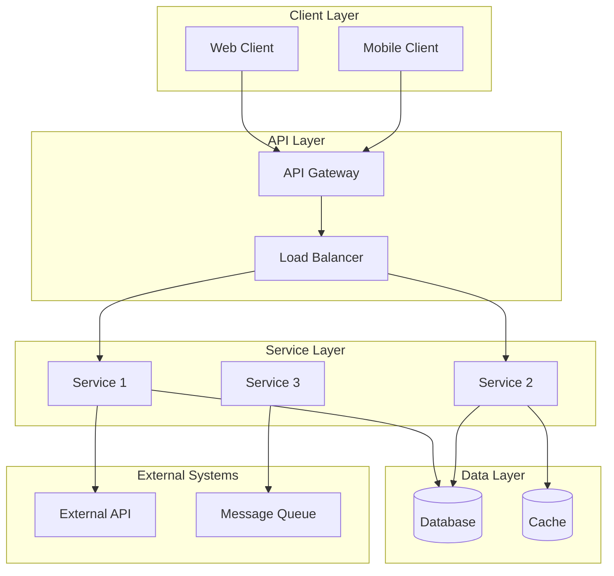
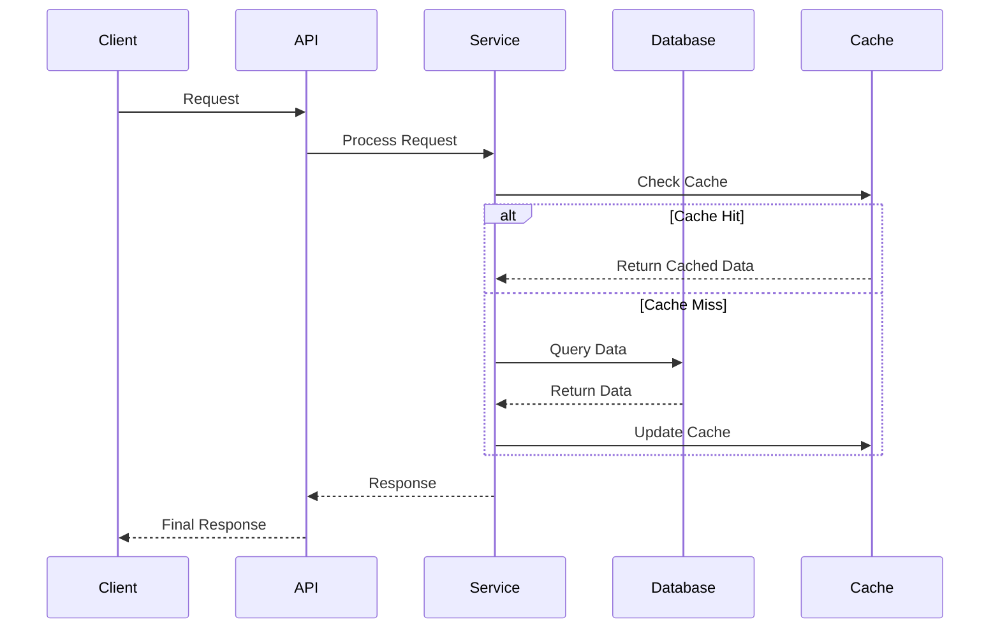

# Technical Design Document: [Feature Name]

**Status**: [Draft | In Review | Approved | Implemented]

**Author(s)**: [Names or agent that generated this]

**Date**: YYYY-MM-DD

**Last Updated**: YYYY-MM-DD

**Related Issue**: [Link to GitHub issue]

**Related Sub-Issues**: [Links to decomposed sub-issues]

---

## Document Overview

**Purpose**: [Why this design document exists]

**Scope**: [What this document covers and what it doesn't]

**Audience**: [Who should read this - developers, architects, product managers, etc.]

---

## Executive Summary

[2-4 sentences providing a high-level overview of:
- What feature/system is being designed
- Why it's needed
- What the proposed solution is
- What the expected impact is]

---

## Background & Context

### Problem Statement
[Describe the problem this design solves:
- What pain points exist today?
- Who is affected?
- What are the business/user implications?]

### Goals & Objectives
1. **[Goal 1]**: [Description]
2. **[Goal 2]**: [Description]
3. **[Goal 3]**: [Description]

### Non-Goals
[What this design explicitly does NOT cover - helps prevent scope creep]
- [Non-goal 1]
- [Non-goal 2]

### Success Metrics
[How will we measure success?]
- **[Metric 1]**: [Target value]
- **[Metric 2]**: [Target value]
- **[Metric 3]**: [Target value]

---

## System Architecture

### High-Level Architecture

[Describe the overall system architecture at a high level]

#### Architecture Diagram



[Provide a clear Mermaid diagram showing major components and their relationships]

### Component Descriptions

#### [Component Name 1]

**Purpose**: [What this component does]

**Technology**: [Programming language, framework, key libraries]

**Responsibilities**:
- [Responsibility 1]
- [Responsibility 2]
- [Responsibility 3]

**Interfaces**:
- **Input**: [What it receives and from where]
- **Output**: [What it produces and where it goes]

**Dependencies**:
- [Dependency 1]
- [Dependency 2]

**Configuration**:
- [Key configuration parameters]

---

#### [Component Name 2]

[Repeat format for each major component]

---

### Data Flow

#### Sequence Diagram



[Provide sequence diagrams for key user flows or processes]

#### Data Flow Description

**Flow 1: [Flow Name]**
1. [Step 1 description]
2. [Step 2 description]
3. [Step 3 description]

[Describe each major data flow in detail]

---

## Data Architecture

### Data Models

#### Entity: [EntityName]

```typescript
interface EntityName {
  id: string;              // UUID, primary key
  field1: string;          // Description
  field2: number;          // Description
  field3: boolean;         // Description
  relatedEntity: string;   // Foreign key to RelatedEntity.id
  metadata: {              // Nested object
    key1: string;
    key2: number;
  };
  createdAt: Date;         // Timestamp
  updatedAt: Date;         // Timestamp
}
```

**Validation Rules**:
- `field1`: Required, max length 255, must match regex pattern
- `field2`: Optional, range 0-1000
- `field3`: Required, default false

**Indexes**:
- Primary: `id`
- Secondary: `field1`, `createdAt`
- Composite: `(relatedEntity, field3)`

**Relationships**:
- One-to-many with `RelatedEntity` via `relatedEntity` field
- Many-to-many with `AnotherEntity` via `EntityNameAnotherEntity` join table

---

#### Entity: [EntityName2]

[Repeat format for each entity]

---

### Database Schema

#### Tables

**Table: `entity_name`**

| Column | Type | Constraints | Description |
|--------|------|-------------|-------------|
| `id` | UUID | PRIMARY KEY | Unique identifier |
| `field1` | VARCHAR(255) | NOT NULL | Description |
| `field2` | INTEGER | NULL | Description |
| `created_at` | TIMESTAMP | NOT NULL, DEFAULT NOW() | Creation timestamp |
| `updated_at` | TIMESTAMP | NOT NULL, DEFAULT NOW() | Last update timestamp |

**Indexes**:
```sql
CREATE INDEX idx_entity_field1 ON entity_name(field1);
CREATE INDEX idx_entity_created ON entity_name(created_at DESC);
```

**Foreign Keys**:
```sql
ALTER TABLE entity_name 
  ADD CONSTRAINT fk_related_entity 
  FOREIGN KEY (related_entity_id) 
  REFERENCES related_entity(id) 
  ON DELETE CASCADE;
```

---

### Database Migration Plan

#### Migration Steps

**Phase 1: Schema Creation**
1. Create new tables
2. Add indexes
3. Add foreign key constraints

**Phase 2: Data Migration** (if applicable)
1. Backfill data from existing tables
2. Validate data integrity
3. Update application to use new schema

**Phase 3: Cleanup** (if applicable)
1. Remove old tables/columns
2. Update documentation

#### Migration Scripts

```sql
-- Migration: 001_create_entity_name_table.sql
CREATE TABLE entity_name (
  id UUID PRIMARY KEY DEFAULT gen_random_uuid(),
  field1 VARCHAR(255) NOT NULL,
  field2 INTEGER,
  created_at TIMESTAMP NOT NULL DEFAULT NOW(),
  updated_at TIMESTAMP NOT NULL DEFAULT NOW()
);

CREATE INDEX idx_entity_field1 ON entity_name(field1);
```

#### Rollback Strategy

[How to safely revert the database changes if needed]

```sql
-- Rollback: 001_create_entity_name_table.sql
DROP TABLE IF EXISTS entity_name CASCADE;
```

---

## Technology Stack

### Backend

**Language/Framework**: [e.g., Node.js with Express, Python with FastAPI]

**Rationale**: [Why this choice]
- [Reason 1]
- [Reason 2]

**Alternatives Considered**: [Other options evaluated]

### Database

**Database**: [e.g., PostgreSQL, MongoDB, Redis]

**Rationale**: [Why this choice]

**Alternatives Considered**: [Other options evaluated]

### API Protocol

**Protocol**: [REST, GraphQL, WebSocket, gRPC]

**Rationale**: [Why this choice]

**Alternatives Considered**: [Other options evaluated]

### Additional Technologies

**[Technology Name]**: [Purpose]
- **Why**: [Rationale]
- **Alternatives**: [Other options]

[List all significant technologies]

---

## Architecture Decision Records (ADRs)

### ADR-001: [Decision Title]

**Status**: Proposed

**Context**: [What problem does this solve?]

**Decision**: [What did we decide?]

**Consequences**:
- **Positive**: [Benefits]
- **Negative**: [Tradeoffs]
- **Mitigations**: [How we address negatives]

---

### ADR-002: [Decision Title]

[Repeat for each significant decision]

[For complete ADR details, see individual ADR documents in `.github/adrs/`]

---

## Integration Points

### Integration with Existing Systems

#### [System Name 1]

**Integration Type**: [REST API, Event-driven, Direct DB access, etc.]

**Direction**: [Inbound, Outbound, Bidirectional]

**Data Exchanged**:
- **Sent**: [Data we send]
- **Received**: [Data we receive]

**Frequency**: [Real-time, Batch, On-demand]

**Error Handling**: [How failures are handled]

**Dependencies**: [What we depend on from this system]

**Impact on System**: [How our integration affects the existing system]

---

#### [System Name 2]

[Repeat for each integration point]

---

### External Services & APIs

#### [Service Name]

**Purpose**: [Why we're using this service]

**API**: [API details - version, authentication]

**Data Flow**: [What data flows in/out]

**Fallback Strategy**: [What happens if service is unavailable]

**Cost Implications**: [Any cost per request/month]

---

## API Design

[Link to detailed API Design document if separate]

### API Endpoints Summary

| Endpoint | Method | Purpose | Auth Required |
|----------|--------|---------|---------------|
| `/api/resources` | GET | List resources | Yes |
| `/api/resources/:id` | GET | Get resource | Yes |
| `/api/resources` | POST | Create resource | Yes |
| `/api/resources/:id` | PUT | Update resource | Yes |
| `/api/resources/:id` | DELETE | Delete resource | Yes |

### Authentication & Authorization

**Authentication Method**: [JWT, API Key, OAuth 2.0]

**Authorization Model**: [RBAC, ABAC, ACL]

**Permissions**: [List of permissions/scopes]

[For complete API specifications, see API Design document]

---

## Security Considerations

### Authentication
[How users/services authenticate]

### Authorization
[How permissions are enforced]

### Data Protection
- **At Rest**: [Encryption method]
- **In Transit**: [HTTPS, TLS version]
- **PII Handling**: [How sensitive data is protected]

### Input Validation
[How we protect against malicious input]
- SQL Injection: [Mitigation]
- XSS: [Mitigation]
- CSRF: [Mitigation]

### Rate Limiting
[How we prevent abuse]

### Audit Logging
[What security events are logged]

### Vulnerability Mitigation
[How we address OWASP Top 10]

---

## Performance Considerations

### Performance Requirements

| Metric | Target | Measurement Method |
|--------|--------|-------------------|
| API Response Time | < 200ms (p95) | APM tools |
| Database Query Time | < 50ms (p95) | Query monitoring |
| Throughput | 1000 req/s | Load testing |
| Page Load Time | < 2s | Browser metrics |

### Optimization Strategies

**Caching**:
- [What is cached]
- [Cache invalidation strategy]
- [Cache technology - Redis, Memcached, CDN]

**Database Optimization**:
- [Indexing strategy]
- [Query optimization]
- [Connection pooling]

**Async Processing**:
- [What operations are async]
- [Queue technology]
- [Retry strategy]

**Resource Optimization**:
- [Code splitting]
- [Image optimization]
- [Compression]

### Load Testing Plan

**Scenarios**:
1. [Scenario 1 - e.g., "Normal load: 100 concurrent users"]
2. [Scenario 2 - e.g., "Peak load: 500 concurrent users"]
3. [Scenario 3 - e.g., "Stress test: 1000+ concurrent users"]

**Tools**: [JMeter, k6, Gatling, etc.]

**Acceptance Criteria**: [What metrics must be met]

---

## Scalability Plan

### Current Scale

**Expected Initial Load**:
- Users: [Number]
- Requests/day: [Number]
- Data volume: [Size]

### Growth Projection

**6 Months**:
- Users: [Number]
- Requests/day: [Number]
- Data volume: [Size]

**12 Months**:
- Users: [Number]
- Requests/day: [Number]
- Data volume: [Size]

### Scaling Strategy

**Horizontal Scaling**:
- [Which components can scale horizontally]
- [Auto-scaling triggers]
- [Load balancing strategy]

**Vertical Scaling**:
- [Which components need vertical scaling]
- [Resource limits]

**Database Scaling**:
- [Read replicas]
- [Sharding strategy]
- [Archival strategy]

**Caching Strategy**:
- [What to cache]
- [Cache eviction policy]
- [Cache warming]

### Bottlenecks & Mitigation

| Bottleneck | Impact | Mitigation |
|------------|--------|------------|
| [Bottleneck 1] | [Impact description] | [How to address] |
| [Bottleneck 2] | [Impact description] | [How to address] |

---

## Error Handling & Resilience

### Failure Scenarios

#### Scenario 1: [Failure Description]

**Trigger**: [What causes this failure]

**Impact**: [What breaks]

**Detection**: [How we know it happened]

**Recovery**: [Automatic recovery steps]

**Manual Intervention**: [If automatic recovery fails]

---

#### Scenario 2: [Failure Description]

[Repeat for each failure scenario]

---

### Retry Strategy

**Transient Failures**:
- Retry attempts: [Number]
- Backoff: [Exponential with jitter]
- Timeout: [Duration]

**Permanent Failures**:
- [How to handle]
- [Dead letter queue]

### Circuit Breakers

**Locations**: [Where circuit breakers are implemented]

**Thresholds**: [Failure rate that triggers open circuit]

**Recovery**: [How/when circuit closes]

### Graceful Degradation

[How the system behaves when parts fail]
- [Degraded mode 1]
- [Degraded mode 2]

---

## Monitoring & Observability

### Metrics to Track

**System Metrics**:
- CPU utilization
- Memory usage
- Disk I/O
- Network I/O

**Application Metrics**:
- Request rate
- Response time (p50, p95, p99)
- Error rate
- Success rate

**Business Metrics**:
- [Business metric 1]
- [Business metric 2]

### Logging Strategy

**Log Levels**:
- ERROR: [When to use]
- WARN: [When to use]
- INFO: [When to use]
- DEBUG: [When to use]

**Structured Logging**: [Format - JSON, etc.]

**Log Aggregation**: [Tool - ELK, Splunk, DataDog]

**Retention**: [How long logs are kept]

### Alerting

**Critical Alerts**:
- [Alert 1] → [Threshold] → [Notification channel]
- [Alert 2] → [Threshold] → [Notification channel]

**Warning Alerts**:
- [Alert 1] → [Threshold] → [Notification channel]

**On-Call**: [Who responds to alerts]

### Tracing

**Distributed Tracing**: [Tool - Jaeger, Zipkin]

**Trace Critical Paths**: [Which flows to trace]

---

## Testing Strategy

### Unit Testing

**Scope**: [What is unit tested]

**Coverage Target**: [e.g., 80%]

**Tools**: [Jest, pytest, JUnit, etc.]

### Integration Testing

**Scope**: [What integration points are tested]

**Test Scenarios**:
- [Scenario 1]
- [Scenario 2]

**Tools**: [Testing framework]

### End-to-End Testing

**Scope**: [What user flows are tested]

**Test Scenarios**:
- [Scenario 1]
- [Scenario 2]

**Tools**: [Cypress, Selenium, Playwright]

### Performance Testing

**Scope**: [What is performance tested]

**Scenarios**: [Load test scenarios]

**Tools**: [JMeter, k6, Gatling]

### Security Testing

**Scope**: [What security aspects are tested]

**Tests**:
- Vulnerability scanning
- Penetration testing
- Dependency scanning

**Tools**: [OWASP ZAP, Snyk, etc.]

---

## Deployment Strategy

### Deployment Method

**Strategy**: [Blue-Green / Rolling / Canary / Feature Flags]

**Rationale**: [Why this approach]

**Rollback Time**: [How long to roll back]

### Infrastructure Changes

**New Resources**:
- [Resource 1 - e.g., "New EC2 instance"]
- [Resource 2 - e.g., "New RDS database"]

**Configuration Changes**:
- [Change 1]
- [Change 2]

**Infrastructure as Code**: [Terraform, CloudFormation, etc.]

### Migration Path

**From**: [Current state]

**To**: [Target state]

**Steps**:
1. [Step 1]
2. [Step 2]
3. [Step 3]

**Validation**: [How to verify migration success]

### Rollback Plan

**Triggers**: [When to roll back]

**Steps**:
1. [Step 1]
2. [Step 2]

**Data Handling**: [How to handle data during rollback]

**Time Estimate**: [How long rollback takes]

---

## Technical Risks & Mitigations

| Risk | Probability | Impact | Mitigation | Owner |
|------|-------------|--------|------------|-------|
| [Risk 1] | High/Med/Low | High/Med/Low | [Mitigation strategy] | [Person/Team] |
| [Risk 2] | High/Med/Low | High/Med/Low | [Mitigation strategy] | [Person/Team] |
| [Risk 3] | High/Med/Low | High/Med/Low | [Mitigation strategy] | [Person/Team] |

---

## Timeline & Milestones

### Implementation Phases

**Phase 1: [Phase Name]** (Week 1-2)
- [ ] [Task 1]
- [ ] [Task 2]
- [ ] [Task 3]

**Phase 2: [Phase Name]** (Week 3-4)
- [ ] [Task 1]
- [ ] [Task 2]

**Phase 3: [Phase Name]** (Week 5-6)
- [ ] [Task 1]
- [ ] [Task 2]

### Key Milestones

| Milestone | Target Date | Status |
|-----------|-------------|--------|
| Design Review | YYYY-MM-DD | Pending |
| API Design Complete | YYYY-MM-DD | Pending |
| Development Complete | YYYY-MM-DD | Pending |
| Testing Complete | YYYY-MM-DD | Pending |
| Production Deploy | YYYY-MM-DD | Pending |

---

## Dependencies

### Blockers

- [ ] [Blocker 1 - e.g., "Need database provisioned"]
- [ ] [Blocker 2]

### Prerequisites

- [ ] [Prerequisite 1]
- [ ] [Prerequisite 2]

### Parallel Work

[Other work that can happen in parallel]
- [Work item 1]
- [Work item 2]

---

## Open Questions

1. **[Question 1]**
   - Context: [Why this is uncertain]
   - Options: [Possible answers]
   - Decision needed by: [Date]

2. **[Question 2]**
   - Context: [Why this is uncertain]
   - Options: [Possible answers]
   - Decision needed by: [Date]

---

## Future Enhancements

[Features or improvements that are out of scope for initial implementation but should be considered for the future]

1. **[Enhancement 1]**: [Description]
2. **[Enhancement 2]**: [Description]
3. **[Enhancement 3]**: [Description]

---

## References

- [Link to GitHub issue]
- [Link to decomposed sub-issues]
- [Link to API Design document]
- [Link to ADR documents]
- [Link to research or articles]
- [Link to prototypes or POCs]

---

## Appendix

### Glossary

- **[Term 1]**: [Definition]
- **[Term 2]**: [Definition]

### Related Documents

- [Document 1]
- [Document 2]

---

## Change Log

| Date | Author | Changes |
|------|--------|---------|
| YYYY-MM-DD | [Name] | Initial draft |
| YYYY-MM-DD | [Name] | Updated after review feedback |
