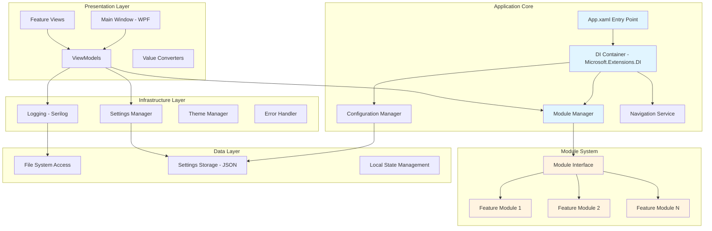
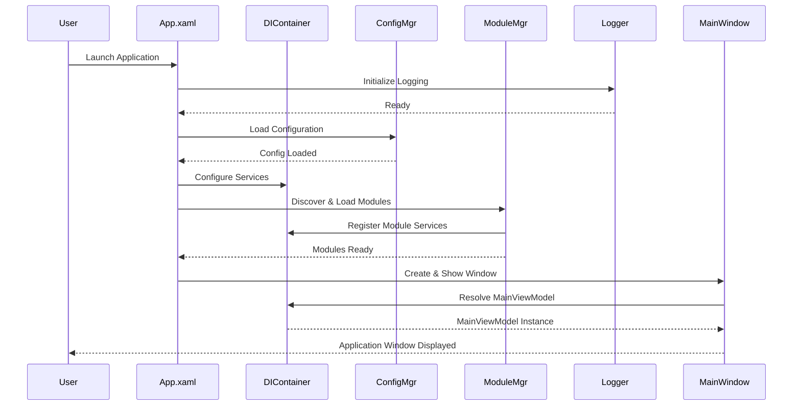
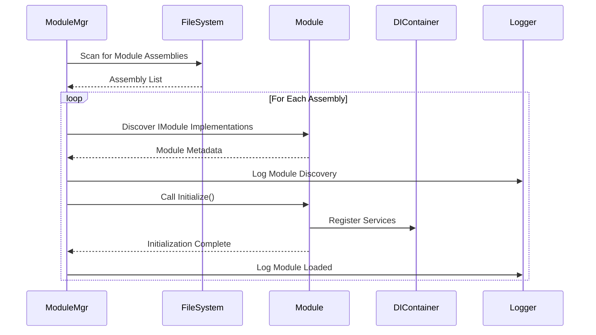
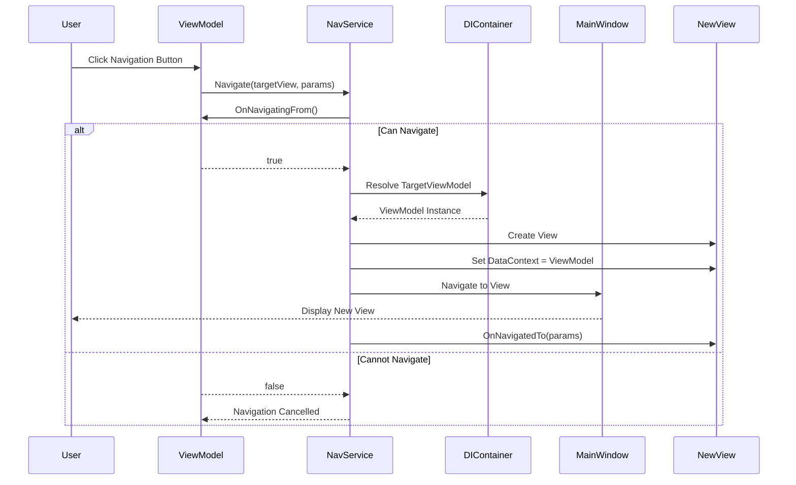

# Technical Design Document: Proximity MVP Foundation - Application Scaffolding

**Status**: Proposed

**Author(s)**: Architecture Agent

**Date**: 2024-01-21

**Last Updated**: 2024-01-21

**Related Issue**: #12 - MVP Foundation: Application Scaffolding

**Related Sub-Issues**: TBD (Pending decomposition)

---

## Document Overview

**Purpose**: Define the technical architecture for the foundational Windows desktop application that will serve as the basis for all MVP features of the Proximity application.

**Scope**: This document covers the base application structure, architectural patterns, technology stack, and extensibility mechanisms needed to support rapid feature development throughout the MVP cycle.

**Audience**: Developers, architects, and technical stakeholders involved in implementing the Proximity MVP.

---

## Executive Summary

This design establishes a modular, extensible Windows desktop application foundation using .NET 6+ with WPF and MVVM architecture. The solution prioritizes rapid feature addition, maintainability, and zero-installation deployment through a portable executable approach. The architecture employs dependency injection for loose coupling, a plugin-style module system for extensibility, and structured logging for diagnostics. This foundation enables the team to deliver MVP features quickly while maintaining code quality and architectural integrity.

---

## Background & Context

### Problem Statement

The Proximity project requires a solid foundational application structure that can accommodate rapid MVP feature development without accumulating technical debt. The application must:
- Support rapid iteration and feature addition throughout the MVP cycle
- Maintain clean architecture principles despite aggressive timelines
- Enable easy testing and debugging during development
- Deploy as a portable executable without requiring installation
- Provide extensibility for future features

### Goals & Objectives

1. **Rapid Development**: Establish patterns and infrastructure that enable quick feature implementation
2. **Modularity**: Create a plugin-style architecture where features can be developed and tested independently
3. **Maintainability**: Implement MVVM and dependency injection for clean separation of concerns
4. **Zero Friction Deployment**: Deliver a portable executable that runs without installation
5. **Developer Experience**: Provide structured logging, clear patterns, and good documentation

### Non-Goals

- Performance optimization beyond baseline requirements (defer to post-MVP)
- Advanced features like auto-updates or crash reporting (defer to post-MVP)
- Multi-platform support (Windows-only for MVP)
- Distributed architecture or microservices (monolithic for MVP simplicity)

### Success Metrics

- **Time to First Feature**: Developers can add a new feature module in < 4 hours
- **Build Time**: Full solution builds in < 30 seconds
- **Startup Time**: Application launches in < 3 seconds
- **Test Coverage**: Core infrastructure achieves > 80% code coverage
- **Module Independence**: Features can be enabled/disabled without code changes

---

## System Architecture

### High-Level Architecture

The application follows a layered architecture with clear separation between UI, business logic, and infrastructure concerns. A module system provides extensibility, while dependency injection manages component lifecycle and dependencies.

#### Architecture Diagram



### Component Descriptions

#### Main Window (WPF)

**Purpose**: Primary application window and navigation container

**Technology**: WPF with XAML

**Responsibilities**:
- Host the main navigation frame
- Provide application-level UI chrome (title bar, menu, status bar)
- Handle window lifecycle events
- Coordinate with Navigation Service for view transitions

**Interfaces**:
- **Input**: User interactions, navigation requests
- **Output**: Visual presentation, window events

**Dependencies**:
- ViewModels for data binding
- Navigation Service for view management
- Theme Manager for visual styling

**Configuration**:
- Window size and position persistence
- Theme selection
- Always-on-top setting

---

#### DI Container (Microsoft.Extensions.DependencyInjection)

**Purpose**: Manage application dependencies and component lifecycle

**Technology**: Microsoft.Extensions.DependencyInjection (built-in .NET)

**Responsibilities**:
- Register all services, ViewModels, and infrastructure components
- Resolve dependencies at runtime
- Manage singleton, scoped, and transient lifetimes
- Enable constructor injection throughout the application

**Interfaces**:
- **Input**: Service registrations from modules
- **Output**: Resolved instances

**Dependencies**:
- None (core .NET framework)

**Configuration**:
- Service lifetimes defined during startup
- Module-specific registrations from ModuleManager

---

#### Module Manager

**Purpose**: Discover, load, and manage feature modules dynamically

**Technology**: C# with reflection-based discovery

**Responsibilities**:
- Scan assemblies for module implementations
- Initialize modules in correct order (based on dependencies)
- Register module services with DI container
- Provide module lifecycle management (enable/disable)
- Handle module errors gracefully

**Interfaces**:
- **Input**: IModule implementations
- **Output**: Module registration with DI container

**Dependencies**:
- DI Container for service registration
- Configuration Manager for enabled modules list
- Logging for module lifecycle events

**Configuration**:
- Module discovery paths
- Module enable/disable settings
- Module load order

---

#### Configuration Manager

**Purpose**: Centralized application and user settings management

**Technology**: C# with System.Text.Json for serialization

**Responsibilities**:
- Load application configuration from appsettings.json
- Load user settings from user-specific JSON file
- Provide strongly-typed configuration access
- Persist user preferences
- Support configuration hot-reload (for development)

**Interfaces**:
- **Input**: Configuration files (JSON)
- **Output**: Strongly-typed configuration objects

**Dependencies**:
- File system access
- JSON serialization

**Configuration**:
- Configuration file paths (relative to executable)
- Default values for missing settings
- Validation rules

---

#### Navigation Service

**Purpose**: Manage view navigation and back/forward history

**Technology**: C# navigation service with WPF Frame

**Responsibilities**:
- Navigate between views
- Maintain navigation history
- Handle navigation parameters
- Support navigation guards (can-navigate checks)
- Coordinate with ViewModels for lifecycle events

**Interfaces**:
- **Input**: Navigation requests with parameters
- **Output**: View transitions

**Dependencies**:
- DI Container for ViewModel resolution
- Main Window for Frame access

**Configuration**:
- View registration (ViewModel to View mapping)
- Default navigation target

---

#### Logging Infrastructure (Serilog)

**Purpose**: Structured logging throughout the application

**Technology**: Serilog with file and console sinks

**Responsibilities**:
- Capture structured log events
- Write logs to rotating log files
- Provide console output during development
- Support log level configuration
- Include contextual information (timestamps, log levels, source)

**Interfaces**:
- **Input**: Log events from throughout application
- **Output**: Log files, console output

**Dependencies**:
- File system access for log storage

**Configuration**:
- Log level (Debug, Info, Warning, Error)
- Log file path and rotation settings
- Output template format
- Sinks to enable (file, console, debug)

---

### Data Flow

#### Application Startup Sequence



#### Feature Module Loading



#### Navigation Flow



---

## Data Architecture

### Data Models

The MVP foundation focuses on configuration and settings management. Business domain models will be added by feature modules.

#### Entity: ApplicationSettings

```csharp
/// <summary>
/// Application-wide configuration settings
/// </summary>
public class ApplicationSettings
{
    /// <summary>
    /// Current theme (Light, Dark, System)
    /// </summary>
    public string Theme { get; set; } = "System";
    
    /// <summary>
    /// Enabled module identifiers
    /// </summary>
    public List<string> EnabledModules { get; set; } = new();
    
    /// <summary>
    /// Log level (Debug, Info, Warning, Error)
    /// </summary>
    public string LogLevel { get; set; } = "Info";
    
    /// <summary>
    /// Window state persistence
    /// </summary>
    public WindowSettings Window { get; set; } = new();
}

public class WindowSettings
{
    public int Width { get; set; } = 1200;
    public int Height { get; set; } = 800;
    public int Left { get; set; } = -1;  // -1 = center
    public int Top { get; set; } = -1;   // -1 = center
    public bool Maximized { get; set; } = false;
}
```

**Validation Rules**:
- `Theme`: Must be "Light", "Dark", or "System"
- `LogLevel`: Must be valid Serilog level
- `Window.Width`: Range 800-4096
- `Window.Height`: Range 600-2160

**Storage**:
- File: `%APPDATA%\Proximity\settings.json`
- Format: JSON
- Encoding: UTF-8

---

#### Entity: ModuleMetadata

```csharp
/// <summary>
/// Module registration information
/// </summary>
public class ModuleMetadata
{
    /// <summary>
    /// Unique module identifier
    /// </summary>
    public string Id { get; set; }
    
    /// <summary>
    /// Display name
    /// </summary>
    public string Name { get; set; }
    
    /// <summary>
    /// Module description
    /// </summary>
    public string Description { get; set; }
    
    /// <summary>
    /// Module version
    /// </summary>
    public Version Version { get; set; }
    
    /// <summary>
    /// Module dependencies (other module IDs)
    /// </summary>
    public List<string> Dependencies { get; set; } = new();
    
    /// <summary>
    /// Whether module is currently enabled
    /// </summary>
    public bool IsEnabled { get; set; } = true;
}
```

**Validation Rules**:
- `Id`: Required, unique, alphanumeric with dots/dashes
- `Name`: Required, max 100 chars
- `Version`: Valid semantic version
- `Dependencies`: All referenced modules must exist

---

### File System Structure

The application uses a portable structure with all files relative to the executable:

```
Proximity.exe                  # Main executable
Proximity.dll                  # Application assembly
Proximity.Core.dll             # Core infrastructure
appsettings.json               # Default configuration
logs/
  proximity-YYYYMMDD.log       # Daily log files (rolling)
modules/
  Proximity.Module.*.dll       # Feature modules (auto-discovered)
%APPDATA%/Proximity/
  settings.json                # User settings (persisted)
```

**Migration Plan**: N/A (new application)

**Rollback Strategy**: Delete `%APPDATA%\Proximity` folder to reset to defaults

---

## Technology Stack

### Framework & Runtime

**Technology**: .NET 6.0 (or .NET 7.0 for latest features)

**Rationale**:
- Modern C# language features (records, pattern matching, nullable reference types)
- High performance with minimal overhead
- Excellent tooling and IDE support
- Cross-platform .NET (enables future Mac/Linux support if needed)
- Long-term support (LTS) for stability
- Self-contained deployment support for portable executable

**Alternatives Considered**:
- **.NET Framework 4.8**: Rejected due to lack of modern features and no future development
- **.NET 8.0**: Considered but .NET 6.0 LTS provides better stability for MVP

---

### UI Framework

**Technology**: WPF (Windows Presentation Foundation) with XAML

**Rationale**:
- Mature, stable UI framework with rich controls
- Excellent designer support in Visual Studio
- Strong data binding with MVVM pattern
- Extensive third-party control libraries available
- Hardware-accelerated rendering
- Native Windows look and feel

**Alternatives Considered**:
- **WinUI 3**: Rejected due to maturity concerns and deployment complexity
- **Avalonia**: Rejected due to smaller ecosystem and less mature tooling
- **Electron**: Rejected due to large bundle size and non-native feel

---

### Architecture Pattern

**Technology**: MVVM (Model-View-ViewModel) with CommunityToolkit.Mvvm

**Rationale**:
- Clear separation of concerns (UI vs. business logic)
- Excellent testability (ViewModels can be unit tested without UI)
- Strong data binding support in WPF
- CommunityToolkit.Mvvm provides boilerplate reduction (source generators)
- Industry-standard pattern for WPF applications
- Supports independent development of UI and logic

**Alternatives Considered**:
- **MVC/MVP**: Rejected as less natural for WPF's data binding model
- **Code-behind only**: Rejected due to poor testability and tight coupling

---

### Dependency Injection

**Technology**: Microsoft.Extensions.DependencyInjection

**Rationale**:
- Built-in .NET framework (no external dependencies)
- Industry-standard API familiar to .NET developers
- Excellent integration with .NET ecosystem
- Supports constructor injection cleanly
- Good performance characteristics
- Enables testability through interface-based design

**Alternatives Considered**:
- **Autofac**: Rejected as heavier than needed for MVP
- **Manual DI**: Rejected due to maintenance burden

---

### Logging

**Technology**: Serilog with file and console sinks

**Rationale**:
- Structured logging with rich context
- Excellent performance
- Flexible sink system (file, console, etc.)
- Rolling file appender built-in
- Clean, simple API
- Wide adoption in .NET community

**Alternatives Considered**:
- **NLog**: Similar capabilities, but Serilog preferred for structured logging
- **Microsoft.Extensions.Logging**: Rejected as less feature-rich without additional sinks

---

### Configuration

**Technology**: Microsoft.Extensions.Configuration with JSON provider

**Rationale**:
- Built-in .NET framework
- Simple JSON-based configuration
- Strongly-typed configuration objects
- Supports hierarchical configuration
- Good for both app settings and user preferences

**Alternatives Considered**:
- **XML configuration**: Rejected as more verbose
- **INI files**: Rejected as less structured

---

### Testing

**Technology**: 
- **Unit Tests**: xUnit with Moq
- **UI Tests**: FlaUI for automated UI testing (post-MVP)

**Rationale**:
- xUnit is modern, extensible, and widely adopted
- Moq provides clean mocking syntax
- FlaUI enables UI automation when needed

---

## Architecture Decision Records (ADRs)

### ADR-001: Use Modular Plugin-Style Architecture

**Status**: Proposed

**Context**: The MVP requires rapid feature addition. We need an architecture that allows features to be developed independently and integrated easily without disrupting existing code.

**Decision**: Implement a module system where each major feature is a separate assembly implementing `IModule`. The Module Manager discovers and loads modules at startup, allowing features to register their services with the DI container.

**Consequences**:
- **Positive**: 
  - Features can be developed and tested in isolation
  - Modules can be enabled/disabled without code changes
  - Clear boundaries between features reduce coupling
  - New team members can contribute features without understanding entire codebase
- **Negative**: 
  - Additional abstraction layer adds slight complexity
  - Module discovery has small startup cost (negligible for MVP)
- **Mitigations**: 
  - Provide clear module template and documentation
  - Cache module discovery results for faster subsequent startups

[See detailed ADR: `/docs/architecture/adrs/ADR-001-modular-architecture.md`]

---

### ADR-002: Use Dependency Injection for Loose Coupling

**Status**: Proposed

**Context**: We need loose coupling between components for testability and flexibility. Constructor injection makes dependencies explicit and supports the Open/Closed Principle.

**Decision**: Use Microsoft.Extensions.DependencyInjection throughout the application with constructor injection as the primary pattern.

**Consequences**:
- **Positive**: 
  - Easy to unit test (mock dependencies)
  - Clear dependency graph
  - Encourages interface-based design
  - Supports changing implementations without code changes
- **Negative**: 
  - Learning curve for developers unfamiliar with DI
  - Slight performance overhead (negligible)
- **Mitigations**: 
  - Provide examples and documentation
  - Use concrete classes for internal implementations (interfaces only where needed)

[See detailed ADR: `/docs/architecture/adrs/ADR-002-dependency-injection.md`]

---

### ADR-003: Use WPF with MVVM Pattern

**Status**: Proposed

**Context**: We need a UI framework that balances productivity, performance, and testability for a Windows desktop application.

**Decision**: Use WPF with MVVM pattern, leveraging CommunityToolkit.Mvvm for boilerplate reduction.

**Consequences**:
- **Positive**: 
  - ViewModels can be unit tested without UI
  - Clear separation between UI and business logic
  - Rich data binding reduces manual UI updates
  - Designer support in Visual Studio
  - Extensive community and third-party controls
- **Negative**: 
  - MVVM has learning curve
  - Data binding can be complex for advanced scenarios
- **Mitigations**: 
  - Provide MVVM examples and templates
  - Use CommunityToolkit.Mvvm to reduce boilerplate

[See detailed ADR: `/docs/architecture/adrs/ADR-003-wpf-mvvm-pattern.md`]

---

### ADR-004: Build Portable Executable Without Installation

**Status**: Proposed

**Context**: We want zero-friction deployment for MVP. Users should be able to run the application without installation or administrative privileges.

**Decision**: Use .NET's self-contained deployment to create a portable executable with all dependencies included. Store user settings in %APPDATA% folder.

**Consequences**:
- **Positive**: 
  - No installation required
  - Works without .NET runtime installed
  - Easy to distribute (single folder)
  - No registry changes or system modifications
  - Easy to uninstall (delete folder)
- **Negative**: 
  - Larger executable size (~60-80 MB)
  - Longer initial download
  - No automatic updates (for MVP)
- **Mitigations**: 
  - Accept size tradeoff for MVP simplicity
  - Consider compression for distribution
  - Add auto-update in post-MVP if needed

[See detailed ADR: `/docs/architecture/adrs/ADR-004-portable-executable.md`]

---

## Integration Points

### Integration with Existing Systems

**N/A** - This is the foundational application with no existing systems to integrate.

---

### External Services & APIs

**N/A** - The MVP foundation has no external service dependencies. Feature modules will add integrations as needed.

---

## API Design

**N/A** - The foundation does not expose external APIs. Internal module APIs are defined through interfaces:

### Core Interfaces

```csharp
/// <summary>
/// Module contract for extensibility
/// </summary>
public interface IModule
{
    /// <summary>
    /// Module metadata
    /// </summary>
    ModuleMetadata Metadata { get; }
    
    /// <summary>
    /// Initialize module and register services
    /// </summary>
    void Initialize(IServiceCollection services);
}

/// <summary>
/// Navigation service contract
/// </summary>
public interface INavigationService
{
    /// <summary>
    /// Navigate to a view by ViewModel type
    /// </summary>
    Task<bool> NavigateToAsync<TViewModel>(object parameter = null) where TViewModel : class;
    
    /// <summary>
    /// Navigate back if possible
    /// </summary>
    bool CanGoBack { get; }
    void GoBack();
}

/// <summary>
/// Configuration service contract
/// </summary>
public interface IConfigurationManager
{
    /// <summary>
    /// Get configuration section
    /// </summary>
    T GetSection<T>(string key) where T : class, new();
    
    /// <summary>
    /// Save configuration
    /// </summary>
    Task SaveAsync();
}
```

---

## Security Considerations

### Authentication

**N/A for MVP** - Single-user desktop application with no authentication requirements.

### Authorization

**N/A for MVP** - No multi-user or permission requirements.

### Data Protection

- **At Rest**: User settings stored in %APPDATA% with NTFS permissions (user-only access)
- **In Transit**: N/A (no network communication in foundation)
- **PII Handling**: No PII collected or stored in MVP foundation

### Input Validation

- Configuration files validated against schema before loading
- Invalid JSON handled gracefully with defaults
- Module metadata validated before loading

### Logging Security

- Logs stored in application folder with user-only access
- No sensitive data logged (no passwords, tokens, etc.)
- Log file rotation prevents disk space exhaustion

### Vulnerabilities Mitigated

- **Arbitrary Code Execution**: Modules loaded only from trusted application folder
- **Path Traversal**: All file paths validated and sanitized
- **Injection Attacks**: N/A (no external input processed)

---

## Performance Considerations

### Performance Requirements

| Metric | Target | Measurement Method |
|--------|--------|-------------------|
| Application Startup | < 3 seconds | Stopwatch from Main() to MainWindow.Loaded |
| Module Loading | < 500ms total | Instrumented logging |
| Memory Footprint | < 150 MB | Task Manager / dotMemory |
| Navigation Transition | < 100ms | Stopwatch in NavigationService |

### Optimization Strategies

**Lazy Loading**:
- Modules discovered at startup but initialized on-demand
- ViewModels resolved only when navigated to
- Heavy resources deferred until first use

**Async Operations**:
- Configuration loading async to prevent UI blocking
- Module initialization async where possible
- File I/O operations all async

**Resource Optimization**:
- Single DI container instance (singleton)
- ViewModels disposed when navigated away
- Log file writer reused (not opened per log entry)

**Startup Optimization**:
- Minimal work in App constructor
- Splash screen if startup exceeds 2 seconds (post-MVP)
- Background thread for non-critical initialization

### Load Testing Plan

**N/A for MVP** - Desktop application with no load/concurrency concerns.

---

## Scalability Plan

### Current Scale

**Expected Initial Load**:
- Users: 5-10 (internal MVP testing)
- Concurrent instances: 1 per user
- Data volume: < 10 MB per user

### Growth Projection

**6 Months**:
- Users: 50-100 (beta testing)
- Data volume: < 100 MB per user

**12 Months**:
- Users: 1000+ (public release)
- Data volume: < 500 MB per user

### Scaling Strategy

**N/A for MVP** - Desktop application scales per-user naturally. No server-side scaling needed.

**Potential Bottlenecks**:
- Large log files: Mitigated by rolling file appender with size limits
- Many modules: Mitigated by lazy initialization
- Large configuration: Mitigated by hierarchical structure and selective loading

---

## Error Handling & Resilience

### Failure Scenarios

#### Scenario 1: Module Failed to Load

**Trigger**: Exception during module initialization

**Impact**: Module unavailable but app continues

**Detection**: Try-catch in ModuleManager with logging

**Recovery**: 
- Log error with full exception details
- Continue loading other modules
- Display warning in UI (optional)

**Manual Intervention**: Check logs, fix module, restart application

---

#### Scenario 2: Configuration File Corrupt

**Trigger**: Invalid JSON in settings.json

**Impact**: Settings not loaded

**Detection**: JsonException during deserialization

**Recovery**:
- Log error with file path
- Use default settings
- Create backup of corrupt file
- Save new default settings file

**Manual Intervention**: Restore from backup or accept defaults

---

#### Scenario 3: Disk Full (Cannot Write Logs)

**Trigger**: IOException during log write

**Impact**: Logs not persisted

**Detection**: Exception from Serilog file sink

**Recovery**:
- Serilog automatically falls back to console/debug output
- Log warning about disk space
- Continue operation without file logging

**Manual Intervention**: Free disk space, restart application

---

### Retry Strategy

**Configuration Loading**:
- Retry attempts: 3
- Backoff: 100ms, 200ms, 500ms
- Timeout: 5 seconds total

**File I/O**:
- Retry attempts: 2
- Backoff: 50ms, 100ms
- Timeout: File-specific (settings: 2s, logs: none)

### Circuit Breakers

**N/A for MVP** - No external service calls requiring circuit breakers.

### Graceful Degradation

- **Module failure**: Application continues without failed module
- **Configuration failure**: Use default configuration
- **Logging failure**: Continue without file logging (use debug output)
- **Navigation failure**: Stay on current view, log error

---

## Monitoring & Observability

### Metrics to Track

**Application Metrics** (via Serilog):
- Startup time
- Module load time per module
- Unhandled exceptions
- Navigation events
- Configuration changes

**System Metrics** (via Windows Task Manager):
- Memory usage
- CPU usage
- Disk I/O

### Logging Strategy

**Log Levels**:
- **Error**: Exceptions, failed operations, critical issues
- **Warning**: Recoverable errors, deprecated usage, validation failures
- **Info**: Startup/shutdown, module loading, configuration changes, navigation
- **Debug**: Detailed flow, variable values, diagnostic information

**Structured Logging Format**:
```
[{Timestamp:yyyy-MM-dd HH:mm:ss.fff}] [{Level:u3}] [{SourceContext}] {Message:lj}{NewLine}{Exception}
```

**Log Aggregation**: Local file-based (no centralized logging for MVP)

**Retention**: 
- Keep last 30 days of logs
- Max 100 MB total log size
- Rolling daily with size limit

### Alerting

**N/A for MVP** - Desktop application with no automated alerting. Users report issues manually.

### Tracing

**Diagnostic Logging**: Detailed execution flow captured at Debug level
- Method entry/exit for critical paths
- Navigation transitions
- Module lifecycle events

---

## Testing Strategy

### Unit Testing

**Scope**: 
- All ViewModels
- Services (ConfigurationManager, ModuleManager, NavigationService)
- Utilities and helpers

**Coverage Target**: > 80%

**Tools**: 
- xUnit for test framework
- Moq for mocking dependencies
- FluentAssertions for readable assertions

**Example Test Structure**:
```csharp
public class MainViewModelTests
{
    [Fact]
    public void Navigate_CallsNavigationService()
    {
        // Arrange
        var navService = new Mock<INavigationService>();
        var viewModel = new MainViewModel(navService.Object);
        
        // Act
        viewModel.NavigateCommand.Execute(null);
        
        // Assert
        navService.Verify(n => n.NavigateToAsync<TargetViewModel>(null), Times.Once);
    }
}
```

### Integration Testing

**Scope**: 
- Module discovery and loading
- Configuration persistence
- DI container configuration
- Navigation flow

**Test Scenarios**:
- Load application with multiple modules
- Save and reload configuration
- Navigate between views
- Enable/disable modules

**Tools**: xUnit with real instances (no mocks)

### End-to-End Testing

**Scope**: 
- Application startup
- Basic navigation flows
- Settings persistence across restarts

**Test Scenarios**:
- Launch application, verify main window appears
- Change settings, restart, verify settings persisted
- Navigate to module view, verify content loaded

**Tools**: 
- FlaUI for UI automation (post-MVP)
- Manual testing for MVP

### Performance Testing

**Scope**: 
- Startup time under various module counts
- Memory usage over extended runtime
- Navigation performance

**Tools**: 
- BenchmarkDotNet for micro-benchmarks
- dotMemory for memory profiling
- Manual testing with stopwatch

### Security Testing

**Scope**: 
- File path validation
- Configuration validation
- Module loading security

**Tests**:
- Attempt to load module from untrusted path
- Provide malformed configuration file
- Validate input sanitization

**Tools**: Manual security testing and code review

---

## Deployment Strategy

### Deployment Method

**Strategy**: Self-contained single-folder deployment

**Rationale**: 
- No installation required
- No prerequisites (includes .NET runtime)
- Portable (can run from USB drive)
- Easy to uninstall (delete folder)

**Rollback Time**: Immediate (replace folder with previous version)

### Build Configuration

**Publish Command**:
```bash
dotnet publish -c Release -r win-x64 --self-contained true -p:PublishSingleFile=false
```

**Build Settings**:
- Target Framework: net6.0-windows
- Runtime Identifier: win-x64
- Self-Contained: true
- PublishSingleFile: false (to allow module discovery)
- ReadyToRun: true (for faster startup)
- PublishTrimmed: false (compatibility with reflection)

### Infrastructure Changes

**New Resources**: N/A (desktop application)

**Configuration Changes**: N/A

**Infrastructure as Code**: N/A

### Distribution Method

**Method**: ZIP file download

**Contents**:
- Proximity.exe and all dependencies
- appsettings.json with defaults
- README.txt with basic instructions
- LICENSE.txt

**Size**: ~60-80 MB (self-contained .NET runtime)

### Migration Path

**From**: N/A (new application)

**To**: Initial release

**Steps**:
1. Build self-contained deployment
2. Package as ZIP file
3. Distribute via GitHub Releases or direct download
4. User extracts and runs Proximity.exe

**Validation**: Launch application, verify startup, check logs

### Rollback Plan

**Triggers**: Critical bugs, crashes on startup, data loss

**Steps**:
1. User deletes Proximity folder
2. User extracts previous version from ZIP
3. Previous settings in %APPDATA% are preserved (backward compatible)

**Data Handling**: Settings schema versioned to support backward compatibility

**Time Estimate**: < 5 minutes

---

## Technical Risks & Mitigations

| Risk | Probability | Impact | Mitigation | Owner |
|------|-------------|--------|------------|-------|
| WPF learning curve slows development | Medium | Medium | Provide MVVM templates and examples; pair programming sessions | Tech Lead |
| Module system adds complexity | Low | Medium | Create clear module template; comprehensive docs | Architect |
| Self-contained deployment creates large executable | High | Low | Accept tradeoff for MVP; consider compression | DevOps |
| .NET 6 compatibility issues on older Windows | Low | High | Test on Windows 10 and 11; document minimum requirements | QA |
| Module conflicts or loading order issues | Medium | High | Implement dependency checking; clear error messages | Dev Team |
| Poor startup performance with many modules | Medium | Medium | Lazy initialization; performance testing | Dev Team |

---

## Timeline & Milestones

### Implementation Phases

**Phase 1: Core Infrastructure** (Week 1)
- [ ] Create solution structure with projects
- [ ] Configure DI container
- [ ] Implement basic logging with Serilog
- [ ] Create configuration management
- [ ] Unit tests for core services

**Phase 2: Module System** (Week 1-2)
- [ ] Design IModule interface
- [ ] Implement ModuleManager with discovery
- [ ] Create sample module for testing
- [ ] Test module loading and lifecycle
- [ ] Documentation for module creation

**Phase 3: WPF Application Shell** (Week 2)
- [ ] Create MainWindow with MVVM
- [ ] Implement NavigationService
- [ ] Create basic theme infrastructure
- [ ] Window state persistence
- [ ] Integration testing

**Phase 4: Polish & Documentation** (Week 2-3)
- [ ] Error handling improvements
- [ ] Performance optimization
- [ ] Comprehensive documentation
- [ ] Developer setup guide
- [ ] Build and deployment scripts

### Key Milestones

| Milestone | Target Date | Status |
|-----------|-------------|--------|
| Architecture Design Approved | 2024-01-21 | Proposed |
| Core Infrastructure Complete | 2024-01-26 | Pending |
| Module System Working | 2024-02-02 | Pending |
| WPF Shell Complete | 2024-02-09 | Pending |
| MVP Foundation Ready | 2024-02-16 | Pending |

---

## Dependencies

### Blockers

- [ ] None (this is the first component)

### Prerequisites

- [ ] Development environment setup (Visual Studio 2022+, .NET 6 SDK)
- [ ] Git repository access
- [ ] CI/CD pipeline configuration (optional for MVP)

### Parallel Work

- Feature planning and decomposition can proceed
- UI/UX design for future features
- Documentation planning

---

## Open Questions

1. **Logging Persistence Strategy**
   - Context: Should logs be kept indefinitely or auto-deleted?
   - Options: 
     - Keep 30 days (current design)
     - Keep 100 MB max regardless of age
     - User-configurable retention
   - Decision needed by: Before implementation
   - **Recommendation**: Keep 30 days OR 100 MB, whichever is reached first

2. **Module Hot-Reload During Development**
   - Context: Should we support reloading modules without restart?
   - Options:
     - Yes (complex but great DX)
     - No (simple, restart required)
   - Decision needed by: Before Phase 2
   - **Recommendation**: No for MVP, add post-MVP if needed

3. **Theme System Scope**
   - Context: How much theming to support in foundation?
   - Options:
     - Basic Light/Dark only
     - Accent color customization
     - Full theme system with resource dictionaries
   - Decision needed by: Before Phase 3
   - **Recommendation**: Basic Light/Dark for MVP

---

## Future Enhancements

1. **Auto-Update System**: Check for updates and download new versions automatically
2. **Crash Reporting**: Automated crash dumps and telemetry (with user consent)
3. **Advanced Logging**: Centralized log aggregation, remote viewing
4. **Module Marketplace**: Download and install modules from online repository
5. **Multi-Instance Support**: Run multiple application instances with different profiles
6. **Cross-Platform Support**: Port to macOS/Linux using Avalonia or MAUI
7. **Plugin Hot-Reload**: Reload modules without application restart

---

## References

- [Issue #12: MVP Foundation - Application Scaffolding](https://github.com/yourusername/proximity/issues/12)
- [WPF Documentation](https://docs.microsoft.com/en-us/dotnet/desktop/wpf/)
- [MVVM Pattern with WPF](https://docs.microsoft.com/en-us/archive/msdn-magazine/2009/february/patterns-wpf-apps-with-the-model-view-viewmodel-design-pattern)
- [Serilog Documentation](https://serilog.net/)
- [CommunityToolkit.Mvvm](https://learn.microsoft.com/en-us/dotnet/communitytoolkit/mvvm/)
- [Self-Contained Deployment](https://docs.microsoft.com/en-us/dotnet/core/deploying/#publish-self-contained)

---

## Appendix

### Glossary

- **MVVM**: Model-View-ViewModel architectural pattern for separating UI from business logic
- **DI**: Dependency Injection - design pattern for loose coupling through constructor injection
- **Module**: Self-contained feature package implementing IModule interface
- **Portable Executable**: Application that runs without installation (xcopy deployment)
- **Self-Contained Deployment**: .NET publishing mode that includes runtime in output

### Project Structure

```
Proximity/
├── Proximity.sln
├── src/
│   ├── Proximity/                          # Main WPF application
│   │   ├── App.xaml / App.xaml.cs         # Application entry point
│   │   ├── MainWindow.xaml / .cs          # Main window
│   │   ├── ViewModels/                     # Application ViewModels
│   │   ├── Views/                          # Application Views
│   │   └── Proximity.csproj
│   ├── Proximity.Core/                     # Core infrastructure
│   │   ├── Configuration/                  # Configuration management
│   │   ├── Logging/                        # Logging infrastructure
│   │   ├── Modularity/                     # Module system
│   │   ├── Navigation/                     # Navigation service
│   │   └── Proximity.Core.csproj
│   └── Proximity.Modules/                  # Feature modules
│       ├── Proximity.Module.Sample/        # Sample module template
│       └── ... (future modules)
├── tests/
│   ├── Proximity.Core.Tests/              # Unit tests for core
│   └── Proximity.Tests/                    # Integration tests
└── docs/
    └── architecture/                       # This document
```

---

## Change Log

| Date | Author | Changes |
|------|--------|---------|
| 2024-01-21 | Architecture Agent | Initial architecture design for MVP foundation |
